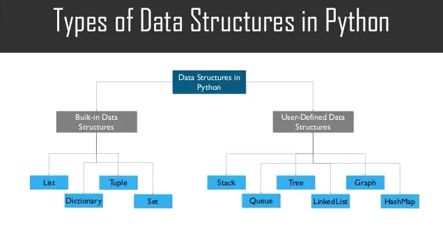

# Python Data Structure Cheat Sheet: Your Complete Guide

Python is a popular programming language that is widely used in various fields such as data science, machine learning, web development, and more. Understanding data structures is essential for any programmer, as it helps in organizing and storing data efficiently. In this article, we will provide you with a Python data structure cheat sheet that you can use as a quick reference guide when working with data in Python.

## What is Data Structure?

The most important thing is organizing, managing, and storing data to allow for easy access and efficient alterations.
Moreover, Data Structures allow us to organize data so that we can store collections of data, relate them, and conduct actions on them as needed.

So, using Data Structures, we can structure our data in a way that allows it to be retrieved rapidly.
However, one Data Structure is insufficient to accommodate all use case scenarios.
As a result, we have a variety of data structures that can be utilized for various purposes.

## Need Of Data Structure

Consider the following scenario: you wish to look for a specific document in a file explorer that contains hundreds of documents.
One method is to go through each document one by one in a sequential fashion, however this is a time-consuming process.

Another option is to go directly to the location where it is kept or where the linked papers are located.

Yes, your operating system (OS) performs this through the use of indexing and hashtables, which are a type of data structure.
Even if there are many files, this decreases the amount of time required to search.
This is why Data Structures are essential.

Now that we know what are data structure let's dive into built-in data structure in python

## Types of Data Structure in Python



Python provides implicit support for Data Structures, which allow you to store and access data.
The data structures involved in this are as follows:

**List, Tuple, Dictionary, and Set are all types of data structures**.

Not only that, but Python also allows users to construct their Data Structures, giving them complete control over their functioning.
The most well-known Data Structures are

**Stack, Queue, Tree, Linked List, Graph, Hash Map, and so on**.

All of the data structures listed above are also accessible in other programming languages such as C, Rust, Javascript,C++, etc.
We have limited our discussion in this post to Python's Built-In Data Structures.

## Built-in Data Structure in Python

As the name implies, the Data Structures in this category are built into Python, making programming more accessible and allowing programmers and data scientists to achieve faster solutions.
Python has the following built-in data structures:

- **List**
- **Dictionaries**
- **Sets**
- **Tuples**

### List

[Lists](https://docs.python.org/3/tutorial/datastructures.html#more-on-lists) are the most basic data structures, and they are used to store data of various types in a sequential order.
The Interpreter allocated addresses to each element of the list called an Index during list creation.
The index value in the list begins at 0 and continues until the last entry; this index is known as the positive index.
We also have negative indexing in Lists, which starts at -1 and allows us to access entries from the last to the first.
Following are the code snippet to grasp lists and their features better.

**Pros**:
1. Versatility: Python lists can store a variety of data types such as strings, integers, and even other lists.

2. Mutable: Lists in Python are mutable, meaning you can modify them after creation. This makes it easy to add or remove elements from a list.

3. Easy to access: Elements in a list are indexed, making it easy to access individual elements within the list.

4. Many built-in methods: Python provides many built-in methods for working with lists, such as sorting, reversing, and slicing.

5. Memory efficient: Lists in Python are implemented using dynamic arrays, which means they can be resized as needed. This makes them more memory efficient compared to other data structures like arrays.

**Cons**:

1. Slow for large data: When dealing with very large amounts of data, Python lists can be slower than other data structures like NumPy arrays or sets.

2. Not suitable for certain operations: Certain operations like searching for an element in a list can be inefficient, especially for large lists. In these cases, other data structures like dictionaries or sets may be more suitable.

3. Time complexity for some operations: Some operations on a Python list, like inserting or deleting elements from the middle of the list, can have a time complexity of O(n). This means that for very large lists, these operations can be slow.

4. Not ideal for ordered data: While Python lists are indexed and maintain order, they are not optimized for searching and sorting, and can be slower than other data structures like arrays or linked lists.


#### Creating List

```python
foo = [] # Empty list
foo = ["Another Techs",52,53,786,110] # creating list
print(foo)
```

#### Accessing element in list

```python
foo = ["Another Techs",52,53,786,110]

# Access all elements
print(foo)

# Access element at certain location say 2nd index
print(foo[2])

# Access element from 1-3
print(foo[1:3])

# Access element in reverse order
print(foo[::-1])
```

#### Adding Element

To add elements to the list, we can utilize the `append()` ,`insert` and `extend()` functions.

1. The `append()` function joins all of the components provided to it as a single element.

2. `insert()` method is use to add element at particular index.

3. The `extend()` function adds the elements to the list one at a time.

```python
foo = ["Another Techs",52,53,786,110]

# Adding elment in list
foo.append(72.3)

# Adding another list
foo.append(["python","Cpp",11])
print(foo)

# Adding another list element one by one in
foo.extend(["Data Science","AI","python3"])

# Add element at particular index
foo.insert(2,"Javascript")
```

#### Deleting Element

`del` keyword is used to delete element at specific index:

```python
foo = ["Another Techs",52,53,786,110]

del foo[4]
print(foo)
```

#### Remove specific element from the list

To remove specific element by it's value from the list we use `remove()` method:

```python
foo = ["Another Techs",52,53,786,110,'cpp']
foo.remove('cpp')
print(foo)
```

#### Remove all the element from the list

`clear()` method is use to remove all the elements from the list:

```python
foo = ["Another Techs",52,53,786,110]

foo.clear()

print(foo) #empty list

```

#### Sort List

The `sort()` function is used to sort the list.
However, while sorting a list, you must ensure that the data types of all the components are the same because we cannot compare two distinct data types, however, you can use a combination of float and int data types:

```python
foo = [111,1,43,23,52,53,786,110]
foo.sort()

print(foo)

```

### Tuples

[Tuples](https://docs.python.org/3/tutorial/datastructures.html#tuples-and-sequences) are similar to lists, except that once data is inserted into a tuple, it cannot be modified in any way, i.e. it is immutable.
The lone exception is when the data inside the tuple is mutable (e.g., a list), in which case we can update the tuple data.
Let us now use the following examples to grasp tuples and their functionalities better.

**Pros:**
1. Immutable: Tuples are immutable, meaning once they are created, you cannot modify them. This makes tuples more reliable and safe than lists, as they cannot be accidentally modified.

2. Faster than lists: Since tuples are immutable, they are generally faster than lists for certain operations like indexing and iteration.

3. Suitable for certain data types: Tuples are suitable for storing data that should not be modified, such as constant values, coordinates, or dates.

4. Memory efficient: Tuples are more memory efficient than lists, as they don't need to be resized or modified after creation.

5. Can be used as dictionary keys: Since tuples are immutable, they can be used as keys in dictionaries, while lists cannot.

**Cons:**

1. Limited functionality: Tuples have limited functionality compared to lists, as they cannot be modified after creation. This makes certain operations like adding or removing elements impossible.

2. Less versatile: Tuples can only store elements of the same data type, unlike lists which can store a variety of data types.

3. Not ideal for large datasets: Tuples are not ideal for storing large datasets, as they cannot be modified or resized. This means that if you need to add or remove elements from a tuple, you will need to create a new tuple, which can be inefficient for large datasets.

4. Less readable: Tuples can be less readable than lists, especially when the tuple contains many elements.

#### Creating Tuples

```python
foo = () # Empty tuple
foo = ("Another Techs",52,53,786,110) # creating tuple

print(type(foo))
print(foo)
```

#### Accessing element in tuple

```python
foo = ("Another Techs",52,53,786,110)

# Access all elements
print(foo)

# Access element at certain location say 2nd index
print(foo[2])

# Access element from 1-3
print(foo[1:3])

# Access element in reverse order
print(foo[::-1])
```

#### Return the index of element in Tuple

To discover the index of a particular element in a tuple, we can use the `index()` function, which accepts the element's value as an input and returns the index.
If we pass an element that does not exist in the tuple to the `index()` function, we get a `ValueError`.

```python
foo = ("Another Techs",52,53,786,110)

print(foo.index(53))
```

#### Adding new elements to the Tuple

We can use the ‘+' operator to append the values in an existing tuple by passing it another tuple to be appended to:

```python
foo = ("Another Techs",52,53,786,110)
foo = foo + ("Python")

print(foo)

# Adding more than one element
foo = foo + ("Cpp","AI")
print(foo)
```

### Dictionaries

**Data is stored in the form of key-value pairs in [dictionaries](https://docs.python.org/3/tutorial/datastructures.html#dictionaries).**

Imagine a phone directory with hundreds of thousands of names of different people and their accompanying phone numbers to comprehend dictionary data structure.
Here are the constant values (such as Name) and Phone Numbers, which we referred to as the keys.

Furthermore, the numerous names and phone numbers are the keys' values.
If we want to get the values of the keys, we will need all of the names and phone numbers.

So a key-value pair is precisely that.
Moreover, Dictionaries are used to hold this structure in Python.

**Pros:**

1. Fast lookup: Dictionaries provide fast lookup times for accessing data, as data is accessed using keys rather than index positions.

2. Easy to update: Dictionaries are mutable, meaning you can add, modify, or delete key-value pairs as needed.

3. Versatile data types: Dictionaries can store a variety of data types as keys and values, such as strings, integers, lists, or even other dictionaries.

4. No duplicate keys: Dictionaries do not allow duplicate keys, ensuring that each key is unique and allowing for easy retrieval of values.

5. Built-in methods: Python provides many built-in methods for working with dictionaries, such as sorting, merging, or iterating over key-value pairs.

**Cons:**

1. Not ordered: Dictionaries are not ordered, meaning that key-value pairs are not stored in any particular order. If you need to maintain order, you will need to use other data structures like lists.

2. Time complexity for some operations: Some operations on a Python dictionary, such as searching for a key, can have a time complexity of O(n). This means that for very large dictionaries, these operations can be slow.

3. Memory usage: Dictionaries can use a significant amount of memory, especially if they contain a large number of key-value pairs.

4. Not suitable for certain operations: Dictionaries are not suitable for certain types of operations, such as iterating over values in a specific order, or performing mathematical operations on values.

#### Creating a Dictionary

```python
foo = {} # Empty dict
print(foo)

foo = {11:'Another Techs',12:'Python',13:'Data Science'}
print(foo)
```

#### Returning the value of particular key in python dictinory

We can only use the keys to access the components of a dictionary. We can use the get() function or just give the key values to retrieve the information.

```python
foo = {11:'Another Techs',12:'Python',13:'Data Science'}
print(foo.get(12)) # Output: Python

```

#### Changing or Adding Key Value Pairs

The **keys** can be used to change the values of the dictionary. As a result, we must first access the key and then alter the value. We just add another key-value pair to add values.

```python
foo = {11:'Another Techs',12:'Python',13:'Data Science'}

# Changing Value
foo[12] = 'Cpp'
print(foo)

# Adding Key Value Pair
foo[14] = "Python"
print(foo)
```

#### Returning sets of the elements in a dictionary

```python
foo = {11:'Another Techs',12:'Python',13:'Data Science'}
print(foo.items())
```

#### Getting All the keys present in dictionary

```python
foo = {11:'Another Techs',12:'Python',13:'Data Science'}
print(foo.keys())
```

#### Getting All the values of keys present in dictionary

```python
foo = {11:'Another Techs',12:'Python',13:'Data Science'}
print(foo.values())
```

#### Deleting Key-Value Pair

**Delete Values**: We can use the `pop()` function to delete values, which returns the deleted value.

**Deleting a Key-Value Pair**: To recover the key-value pair, use the `popitem()` method, which provides a key and value tuple.

**Clearing the Entire Dictionary**: The `clear()` function can be used to clean the entire dictionary.

```python
foo = {11:'Another Techs',12:'Python',13:'Data Science'}
# Pop the specified element
bar = foo.pop('12')
print('Value:', bar)
print('Dictionary:', foo)

# Pop the complete key-value pair
bar = foo.popitem()
print('Key, value pair:', bar)
print('Dictionary', foo)

# Make the dictionary Empty
foo.clear()
print('Empty Dictionary', foo)

```

### Sets

A [set](https://docs.python.org/3/tutorial/datastructures.html#sets) is a data type consisting of a collection of unordered elements and is a mutable (changeable) collection of unique components, i.e. there are no duplicate copies of elements.
Unlike arrays, which are type-specific, elements in sets can be of any data type.
Because the values of a set are unindexed, indexing operations cannot be performed on them.

**Pros:**

1. Unique elements: Sets only store unique elements, meaning there are no duplicates. This makes them ideal for removing duplicates from lists or other collections.

2. Fast operations: Sets provide fast operations for checking membership, intersection, union, and difference between sets. This is because sets are implemented using hash tables.

3. Math operations: Sets can be used to perform math operations like union, intersection, and difference between sets. This can be useful in many applications, such as data analysis or graph theory.

4. Flexible data types: Sets can store a variety of data types, including numbers, strings, and tuples.

5. Mutable: Sets are mutable, meaning you can add or remove elements as needed.

**Cons:**

1. Unordered: Like dictionaries, sets are unordered. This means that elements are not stored in any particular order, and you cannot access elements using an index.

2. Cannot store mutable data types: Sets cannot store mutable data types like lists or other sets. This is because the hash value of a mutable object can change, making it difficult to implement the hash table.

3. Memory usage: Like dictionaries, sets can use a significant amount of memory, especially if they contain a large number of elements.

4. Type casting: Type casting can be slow, especially when converting from lists to sets or vice versa.

#### Creating Sets

```python
foo = {'Another Techs','Python','Data Science'}
print(type(foo))
print(foo)
```

#### Accessing Element of sets

**Note**:_We cannot access the set elements using the index numbers because, as previously stated, set elements are not indexed.
As a result, if we wish to access the items of a set, we can use a for loop to do so._

```python
foo = {'Another Techs','Python','Data Science'}

for elem in foo:
    print(elem)
```

#### Adding Element

Using one of the two functions, we may add the new elements to a set.

- The `add()` function is used to add a single element.

- To adding multiple element use the `update()` function.

```python
# Adding Elements
foo = {'Another Techs','Python','Data Science'}
foo.add('Javascript')

print(foo)

# Adding more than one element
foo.update('Cpp',"AI","pandas","numpy")
print(foo)
```

#### Remove element from a set:

```python
foo = {'Another Techs','Python','Data Science'}
foo.re­mov­e("Python­") # If "Python" is not present, raises a KeyErorr

# using Discard method
foo.di­sca­rd(­"­Python") # Removes the element, if present

#Remove every element from the set
foo.cl­ear()
```

#### Operation on sets

```python
foo = {'Another Techs','Python','Data Science'}
bar = {'Another Techs','Python','cpp','javascript','Data Science'}

## Union of sets
foo | mySet2

# Inters­ection of two sets
foo & bar

# Difference of two sets
foo - bar

# Symmetric difference of two sets
foo ^ bar
```

## References

- https://docs.python.org/3/tutorial/datastructures.html
- https://www.tutorialspoint.com/python/python_data_structure.html
- https://whataftercollege.com/python-programming/built-in-data-structures-in-python/
- https://www.slideshare.net/EdurekaIN/what-are-data-structures-in-python-list-dictionary-tuple-explained-edureka
