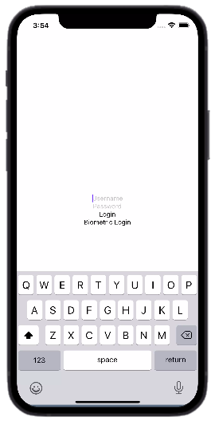

# Implementing Biometric Authentication in React Native Made Easy

An extremely safe and practical method of user authentication is biometric authentication. To confirm a user's identification, it uses physical or behavioural traits like fingerprints or facial recognition. React Native is a well-liked cross-platform framework for creating mobile apps, and adding biometric authentication can improve the security and user experience of your React Native app. In this article, we'll go through step-by-step instructions for implementing biometric authentication in React Native.

## Table of Content

1. [Understanding Biometric Authentication](#heading-1)
2. [Setting Up a React Native Project](#heading-2)
3. [Integrating Biometric Authentication into Your React Native App](#heading-3)
4. [Real-World Use Cases and Code Examples](#heading-4)
    * [Biometric Authentication for Banking Apps](#sub-heading-1)
    * [Biometric Authentication for Healthcare Apps](#sub-heading-2)
5. [Best Practise](#heading-5)
6. [Conclusion](#heading-6)

## <p id="heading-1">Understanding Biometric Authentication</p>

In React Native, biometric authentication works by using the device's biometric sensors to verify the user's identity. When a user tries to log in to the app, they can utilise biometric information such as their fingerprint or facial recognition to authenticate rather than a password.

 The React Native app can request access to the device's biometric sensors and, if granted, collect biometric data from the sensor. This information is then matched to the user's previously saved biometric data, which was gathered during the registration process.

If the biometric data gathered matches the data saved, the user is successfully verified and provided access to the app. The user is denied access if the biometric data does not match.

## <p id="heading-2"> Setting Up a React Native Project </p>

1. Using the command `npx react-native init myproject`, create a new React Native project.
2. Using the command `npm install react-native-biometrics`, install the `react-native-biometrics` package.
3. Use the command `npx react-native link react-native-biometrics` to add the package to your project.
4. Run `npx react-native run-ios` or `npx react-native run-android` to ensure that the package is correctly linked.

## <p id="heading-3"> Integrating Biometric Authentication into Your React Native App </p>

Follow these steps to implement biometric authentication into your React Native app:

1. In your component, import the `react-native-biometrics` package.

```jsx
import * as LocalAuthentication from 'react-native-biometrics';

```

2. Create a function in your component to handle biometric authentication.

```jsx
const handleAuthentication = () => {
  LocalAuthentication.authenticate({
    promptMessage: 'Authenticate to access the app',
    fallbackLabel: 'Use passcode instead',
    disableDeviceFallback: true,
  }).then((result) => {
    if (result.success) {
      console.log('Authentication successful');
      // Allow user to access app
    } else {
      console.log('Authentication failed');
      // Display error message
    }
  });
};

```

3. Add a button to your component's render method that activates the biometric authentication capability.


```jsx
<Button title="Authenticate" onPress={handleAuthentication} />

```
4. Test the app on a biometric sensor-equipped device to check that the authentication procedure works as expected.

The `authenticate()` function from the `react-native-biometrics` package is used in the above example to prompt the user to authenticate using their biometric information. As an argument, the function accepts an object that contains options such as the prompt message and fallback label.

The `authenticate()` function returns an object with the `success` property set to `true` when the user successfully authenticates. The success value is set to `false` if authentication fails.

You may provide a secure and convenient way for users to access your app by including biometric authentication into your React Native app.

Below is the "Hello world" programing for using biometric authentication

```jsx
import React from 'react';
import { View, Text, Button } from 'react-native';
import * as LocalAuthentication from 'react-native-biometrics';

const App = () => {

  const handleAuthentication = () => {
    LocalAuthentication.authenticate({
      promptMessage: 'Authenticate to access the app',
      fallbackLabel: 'Use passcode instead',
      disableDeviceFallback: true,
    }).then((result) => {
      if (result.success) {
        console.log('Authentication successful');
        alert('Authentication successful! Welcome to the app.');
      } else {
        console.log('Authentication failed');
        alert('Authentication failed. Please try again.');
      }
    });
  };

  return (
    <View style={{ flex: 1, alignItems: 'center', justifyContent: 'center' }}>
      <Text>Hello World!</Text>
      <Button title="Authenticate" onPress={handleAuthentication} />
    </View>
  );
};

export default App;

```

This example code creates a simple React Native app with a "Hello World" message and a button to trigger biometric authentication. When the user presses the button, the `handleAuthentication()` function is called to authenticate using the `react-native-biometrics` package. If authentication is successful, an alert message is displayed welcoming the user to the app. If authentication fails, an error message is displayed.


## <p id="heading-4"> Real-World Use Cases and Code Examples </p>

### <p id="sub-heading-2">Biometric Authentication for Banking Apps</p>

First, we must install the required packages. The `react-native-biometrics` and `react-native-keychain` packages will be used. The `react-native-biometrics` package allows us to do biometric authentication, while `react-native-keychain` allows us to securely store and retrieve the user's login credentials.

```jsx
import React, { useState } from 'react';
import { View, Text, TextInput, TouchableOpacity } from 'react-native';
import * as LocalAuthentication from 'react-native-biometrics';
import * as Keychain from 'react-native-keychain';

const LoginScreen = () => {

  const [username, setUsername] = useState('');
  const [password, setPassword] = useState('');

  const handleLogin = async () => {
    // Perform login with username and password
    // ...
    // If login successful, store credentials in Keychain
    await Keychain.setGenericPassword(username, password);
    // Navigate to main screen
    // ...
  };

  const handleBiometricLogin = async () => {
    try {
      const result = await LocalAuthentication.authenticateAsync({
        promptMessage: 'Authenticate to log in',
        fallbackLabel: 'Use passcode instead',
        disableDeviceFallback: true,
      });
      if (result.success) {
        // Retrieve stored credentials from Keychain
        const credentials = await Keychain.getGenericPassword();
        if (credentials) {
          // Perform login with stored credentials
          // ...
          // If login successful, navigate to main screen
          // ...
        } else {
          alert('Could not retrieve stored credentials');
        }
      } else {
        alert('Authentication failed. Please try again.');
      }
    } catch (error) {
      console.log(error);
    }
  };

  return (
    <View style={{ flex: 1, alignItems: 'center', justifyContent: 'center' }}>
      <TextInput
        placeholder="Username"
        onChangeText={text => setUsername(text)}
        value={username}
      />
      <TextInput
        placeholder="Password"
        onChangeText={text => setPassword(text)}
        value={password}
        secureTextEntry
      />
      <TouchableOpacity onPress={handleLogin}>
        <Text>Login</Text>
      </TouchableOpacity>
      <TouchableOpacity onPress={handleBiometricLogin}>
        <Text>Biometric Login</Text>
      </TouchableOpacity>
    </View>
  );
};

export default LoginScreen;

```



We've added two functions to the code above: `handleLogin` and `handleBiometricLogin`. With the user's `username` and `password`, the `handleLogin` function will handle the login procedure. If the login succeeds, the user's credentials are saved in the Keychain via the setGenericPassword function. The biometric login procedure will be handled by the `handleBiometricLogin` function. This function is invoked when the user clicks the "Biometric Login" button. The `react-native-biometrics` function `authenticateAsync` is used to start the biometric authentication process. If authentication is successful, the saved credentials are obtained using the `react-native-keychain` `getGenericPassword` method. If the credentials are successfully obtained, the login process is carried out using the stored credentials.

### <p id="sub-heading-2"> Biometric Authentication for Healthcare Apps</p>
Here's an example code for implementing biometric authentication in a healthcare app:

```jsx
import React, { useState } from 'react';
import { View, Text, TouchableOpacity } from 'react-native';
import * as LocalAuthentication from 'react-native-biometrics';
import * as Keychain from 'react-native-keychain';

const HealthDataScreen = () => {

  const [healthData, setHealthData] = useState(null);

  const retrieveHealthData = async () => {
    try {
      // Authenticate using biometric authentication
      const result = await LocalAuthentication.authenticateAsync({
        promptMessage: 'Authenticate to access health data',
        fallbackLabel: 'Use passcode instead',
        disableDeviceFallback: true,
      });
      if (result.success) {
        // Retrieve health data from secure storage
        const credentials = await Keychain.getGenericPassword();
        if (credentials) {
          // Decrypt stored data using password
          const decryptedData = await decryptData(credentials.password);
          // Set state to decrypted data
          setHealthData(decryptedData);
        } else {
          alert('Could not retrieve stored credentials');
        }
      } else {
        alert('Authentication failed. Please try again.');
      }
    } catch (error) {
      console.log(error);
    }
  };

  const decryptData = async (password) => {
    // Retrieve encrypted health data from storage
    // ...
    // Decrypt using password
    // ...
    // Return decrypted data
    // ...
  };

  return (
    <View style={{ flex: 1, alignItems: 'center', justifyContent: 'center' }}>
      {healthData ? (
        <View>
          <Text>{healthData}</Text>
        </View>
      ) : (
        <TouchableOpacity onPress={retrieveHealthData}>
          <Text>Retrieve Health Data</Text>
        </TouchableOpacity>
      )}
    </View>
  );
};

export default HealthDataScreen;

```


In this case, the user is required to login using biometric authentication before accessing their health data. The health data is encrypted and can only be decrypted using a password that is securely saved in the Keychain. After authenticating the user, the password is taken from the Keychain and used to decode the health data. After that, the decrypted data is displayed on the screen.

## <p id="heading-5">Best Practise</p>

There are a few best practises to consider when adding biometric authentication in your React Native app to ensure the app's security and usability. Here are a few pointers and code examples:

1. Always provide an alternative login method: Because not all users have biometric capabilities or prefer not to utilise biometrics, it is critical to always provide an alternative login option, such as a username and password.

**Example**

```jsx
const handleLogin = async () => {
  // Check if biometric authentication is available
  const isBiometricsAvailable = await LocalAuthentication.hasHardwareAsync();
  if (isBiometricsAvailable) {
    // Prompt biometric authentication
    const result = await LocalAuthentication.authenticateAsync();
    if (result.success) {
      // If biometric authentication is successful, perform login
      // ...
    } else {
      // If biometric authentication fails or is cancelled, show an error message and provide an alternative login method
      alert('Biometric authentication failed. Please use your username and password to log in.');
    }
  } else {
    // If biometric authentication is not available, provide an alternative login method
    // ...
  }
};
```
2. Use safe storage for user credentials: To prevent unauthorised access, use secure storage such as Keychain or encrypted storage for storing user credentials.

**Example**

```jsx
// Store user credentials securely
await Keychain.setGenericPassword(username, password);

// Retrieve user credentials securely
const credentials = await Keychain.getGenericPassword();

```

3. If biometric authentication fails or is unavailable, give clear and succinct error messages to guide the user and avoid confusion.

***Example**

```jsx
// Handle biometric authentication errors
try {
  const result = await LocalAuthentication.authenticateAsync();
  if (result.success) {
    // ...
  } else if (result.error === 'user_fallback') {
    alert('Please use your username and password to log in.');
  } else {
    alert('Biometric authentication failed. Please try again.');
  }
} catch (error) {
  console.log(error);
  alert('Biometric authentication is unavailable on this device.');
}

```

4. Consider the consequences of biometric data for privacy and security: Biometric data is sensitive information, thus it must be handled with caution and in accordance with best practises for storing and transferring sensitive data.

```jsx
// When transmitting biometric data, use HTTPS and secure encryption
const response = await fetch('https://example.com/api/biometric', {
  method: 'POST',
  headers: {
    'Content-Type': 'application/json',
  },
  body: JSON.stringify({
    biometricData: encryptedBiometricData,
  }),
});

```


## <p id="heading-6"> Conclusion </p>

Finally, biometric authentication is a very safe and convenient method of authenticating a user's identification. React Native makes it simple and easy to implement biometric authentication in mobile applications. Developers can simply integrate fingerprint and face recognition features into their projects by using the React Native Biometric API. Developers may assure the security and reliability of their biometric authentication system with correct implementation and best practises.

Overall, biometric authentication enhances the user experience while also adding an extra layer of protection to mobile applications. Biometric authentication has become an integral aspect of mobile app development as more individuals use mobile devices to undertake sensitive tasks such as financial transactions and accessing secret information. As a result, developers should seriously consider including biometric identification into their React Native mobile applications.
