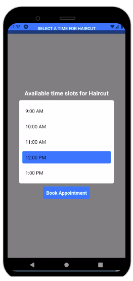

# React Native Modal- A Beginner's Guide to Creating User-Friendly Interfaces

## Introduction

React Native is a popular JavaScript framework that allows developers to create mobile applications for iOS and Android using a single codebase. It offers a wide range of components that can be used to create complex user interfaces. One such component is the React Native Modal.

Modal is a popup window that appears on top of the current screen, and it can be used for a variety of purposes, such as displaying information, confirming user actions, or prompting for input. React Native Modal is a powerful and versatile component that makes it easy to create customizable modals for your app.

In this guide, we will walk you through the basics of using React Native Modal, including how to create, customize, and implement it in your app. By the end of this article, you will have a solid understanding of how to create user-friendly interfaces with React Native Modal.

## Table of Content

* What is React Native Modal?
* How to create a React Native Modal?
* Customizing React Native Modal
* Use Case Example of React Native Modal
* Frequently Asked Questions (FAQs)
* Conclusion

## What is React Native Modal?

React Native Modal is a component that provides a simple way to create modals in your mobile application. It allows you to create a popup window that can be displayed on top of the current screen, making it ideal for displaying information, getting user input, or confirming user actions.

Modal is a user-friendly way to interact with your app, as it provides a focused and interruptive experience. When a modal is displayed, the user cannot interact with the rest of the app until they have interacted with the modal.

## How to create a React Native Modal?

Creating a React Native Modal is straightforward, and it involves using the Modal component that comes with React Native. Here's an example of how to create a basic modal:

1. Import Modal component from React Native:

```jsx
import { Modal } from 'react-native';
```

2. Create a state variable that will determine whether the modal is visible or not:

```jsx
const [modalVisible, setModalVisible] = useState(false);

```

3. Create a function that will toggle the modal's visibility when called:

```jsx
const toggleModal = () => {
  setModalVisible(!modalVisible);
};
```

4. Create a button that will trigger the toggleModal function when pressed:

```jsx

<Button
  title="Open Modal"
  onPress={toggleModal}
/>
```

5. Finally, create the Modal component and include the content you want to display:

```jsx
<Modal
  visible={modalVisible}
  animationType="slide"
>
  <View>
    <Text>This is a modal!</Text>
    <Button title="Close" onPress={toggleModal} />
  </View>
</Modal>
```

This example creates a basic modal that displays a text message and a close button. When the button is pressed, the modal's visibility is toggled, and the modal is closed.

## Customizing React Native Modal

React Native Modal is highly customizable, and you can modify its appearance and behavior to suit your needs. Here are some of the ways you can customize your modals:

### 1. Animation type

 You can specify the animation type that will be used when the modal is displayed or closed. There are several animation types to choose from, including slide, fade, and none.

 #### Example

 ```jsx
 import { Modal } from 'react-native';

const MyModal = () => {
  const [modalVisible, setModalVisible] = useState(false);

  const toggleModal = () => {
    setModalVisible(!modalVisible);
  };

  return (
    <>
      <Button title="Open Modal" onPress={toggleModal} />
      <Modal
        visible={modalVisible}
        animationType="slide" // Change animation type here
        onRequestClose={toggleModal}
      >
        <View style={styles.modalContainer}>
          <Text>This is my modal!</Text>
          <Button title="Close Modal" onPress={toggleModal} />
        </View>
      </Modal>
    </>
  );
};

const styles = StyleSheet.create({
  modalContainer: {
    backgroundColor: 'white',
    padding: 20,
    borderRadius: 10,
  },
});

 ```
 In the code above, we've changed the animation type of the modal to 'slide'. This means that the modal will slide up from the bottom of the screen when it's opened and slide down when it's closed.

Other animation types you can choose from include 'fade', which fades the modal in and out, and 'none', which displays the modal without any animation.

You can experiment with different animation types to find the one that works best for your app's design and user experience.

### 2. Background color

 You can change the background color of the modal to match your app's theme or branding.

 

 #### Example

 ```jsx
 import { Modal } from 'react-native';

const MyModal = () => {
  const [modalVisible, setModalVisible] = useState(false);

  const toggleModal = () => {
    setModalVisible(!modalVisible);
  };

  return (
    <>
      <Button title="Open Modal" onPress={toggleModal} />
      <Modal
        visible={modalVisible}
        transparent={true}
        animationType="slide"
        onRequestClose={toggleModal}
      >
        <View style={styles.modalContainer}>
          <View style={styles.modalView}>
            <Text>This is my modal!</Text>
            <Button title="Close Modal" onPress={toggleModal} />
          </View>
        </View>
      </Modal>
    </>
  );
};

const styles = StyleSheet.create({
  modalContainer: {
    flex: 1,
    justifyContent: 'center',
    alignItems: 'center',
    backgroundColor: 'rgba(0,0,0,0.5)',
  },
  modalView: {
    backgroundColor: 'white',
    padding: 20,
    borderRadius: 10,
    alignItems: 'center',
    elevation: 5,
  },
});

 ```

 In the code above, we've set the backgroundColor style property of the modalContainer to `rgba(0,0,0,0.5)`, which is a semi-transparent black color. This will give the modal a dimmed background when it's displayed.

You can experiment with different colors to find the one that works best for your app's design and user experience. If you want to make the modal completely transparent, you can set `transparent={true}` on the Modal component.

_In the example code above, we've also added a `modalView` style to customize the appearance of the modal itself. This includes a white background color, padding, and rounded corners. You can customize this style as well to achieve the desired look for your modal._

### 3. Content layout

 You can add any content you want to the modal, including text, images, and other components. You can also adjust the layout of the content to fit the modal's dimensions.

 #### Example

```jsx
import { Modal } from 'react-native';

const MyModal = () => {
  const [modalVisible, setModalVisible] = useState(false);

  const toggleModal = () => {
    setModalVisible(!modalVisible);
  };

  return (
    <>
      <Button title="Open Modal" onPress={toggleModal} />
      <Modal
        visible={modalVisible}
        transparent={true}
        animationType="slide"
        onRequestClose={toggleModal}
      >
        <View style={styles.modalContainer}>
          <View style={styles.modalView}>
            <Text style={styles.modalHeader}>Modal Header</Text>
            <View style={styles.modalContent}>
              <Text style={styles.modalText}>Lorem ipsum dolor sit amet, consectetur adipiscing elit. Nulla tristique urna eget commodo laoreet. Aliquam ac justo in augue vehicula commodo vitae quis tellus. Morbi lobortis ac quam id convallis. Ut imperdiet blandit metus vitae auctor.</Text>
              <Image style={styles.modalImage} source={require('./image.jpg')} />
              <Button title="Close Modal" onPress={toggleModal} />
            </View>
          </View>
        </View>
      </Modal>
    </>
  );
};

const styles = StyleSheet.create({
  modalContainer: {
    flex: 1,
    justifyContent: 'center',
    alignItems: 'center',
    backgroundColor: 'rgba(0,0,0,0.5)',
  },
  modalView: {
    backgroundColor: 'white',
    borderRadius: 10,
    padding: 20,
    alignItems: 'center',
    elevation: 5,
  },
  modalHeader: {
    fontSize: 24,
    fontWeight: 'bold',
    marginBottom: 10,
  },
  modalContent: {
    alignItems: 'center',
  },
  modalText: {
    marginBottom: 20,
  },
  modalImage: {
    width: 200,
    height: 200,
    resizeMode: 'contain',
    marginBottom: 20,
  },
});

```
In the code above, we've created a basic layout for the content of the modal. The modal itself is centered on the screen and has a semi-transparent black background.

Inside the modal, we have a header with a bold text style, followed by the main content of the modal. In this example, the content includes a text block, an image, and a button to close the modal.

To customize the layout of the content, we've added several styles to the StyleSheet.create function. These include styles for the header, the content container, the text block, the image, and the modal itself.

You can adjust these styles to achieve the desired layout and appearance for your modal content. For example, you might want to add additional text blocks or images, or adjust the spacing between elements.

### 4. Size and position

You can control the size and position of the modal by setting its width, height, and margin values.

#### Example

```jsx
import { Modal, View, StyleSheet, TouchableOpacity, Text } from 'react-native';

const MyModal = () => {
  const [modalVisible, setModalVisible] = useState(false);

  const toggleModal = () => {
    setModalVisible(!modalVisible);
  };

  return (
    <View style={styles.container}>
      <TouchableOpacity style={styles.button} onPress={toggleModal}>
        <Text style={styles.buttonText}>Open Modal</Text>
      </TouchableOpacity>

      <Modal
        visible={modalVisible}
        transparent={true}
        animationType="slide"
        onRequestClose={toggleModal}
      >
        <View style={styles.modalContainer}>
          <View style={styles.modalView}>
            <Text style={styles.modalHeader}>Modal Header</Text>
            <View style={styles.modalContent}>
              <Text style={styles.modalText}>
                Lorem ipsum dolor sit amet, consectetur adipiscing elit.
                Nulla tristique urna eget commodo laoreet. Aliquam ac justo
                in augue vehicula commodo vitae quis tellus.
              </Text>
              <TouchableOpacity style={styles.button} onPress={toggleModal}>
                <Text style={styles.buttonText}>Close Modal</Text>
              </TouchableOpacity>
            </View>
          </View>
        </View>
      </Modal>
    </View>
  );
};

const styles = StyleSheet.create({
  container: {
    flex: 1,
    alignItems: 'center',
    justifyContent: 'center',
  },
  button: {
    backgroundColor: '#2196F3',
    padding: 10,
    borderRadius: 5,
    marginBottom: 10,
  },
  buttonText: {
    color: 'white',
    fontSize: 20,
    fontWeight: 'bold',
  },
  modalContainer: {
    flex: 1,
    alignItems: 'center',
    justifyContent: 'center',
    backgroundColor: 'rgba(0,0,0,0.5)',
  },
  modalView: {
    backgroundColor: 'white',
    borderRadius: 10,
    padding: 20,
    alignItems: 'center',
    elevation: 5,
    width: '80%', // Set width to 80% of screen width
    height: '50%', // Set height to 50% of screen height
  },
  modalHeader: {
    fontSize: 24,
    fontWeight: 'bold',
    marginBottom: 10,
  },
  modalContent: {
    alignItems: 'center',
  },
  modalText: {
    marginBottom: 20,
  },
});
```
In the code above, we've added two new styles to control the size and position of the modal:

* `modalView`: This style sets the width and height of the modal to 80% and 50% of the screen, respectively. This ensures that the modal is large enough to display its contents, but not so large as to obscure the rest of the screen. We've also centered the modal horizontally and vertically using alignItems and justifyContent.

* `modalContainer`: This style sets the background color of the modal container to a semi-transparent black, giving the modal a dimmed appearance. We've also centered the container horizontally and vertically using alignItems and justifyContent.

You can adjust these styles to achieve the desired size and position for your modal. For example, you might want to make the modal taller or wider, or position it differently on the screen.

### 5. Transparency

 You can adjust the transparency of the modal by setting its opacity value.

#### Example

```jsx
import React, { useState } from 'react';
import { Modal, Text, TouchableOpacity, View, StyleSheet } from 'react-native';

const MyModal = () => {
  const [modalVisible, setModalVisible] = useState(false);

  const toggleModal = () => {
    setModalVisible(!modalVisible);
  };

  return (
    <View style={styles.container}>
      <TouchableOpacity style={styles.button} onPress={toggleModal}>
        <Text style={styles.buttonText}>Open Modal</Text>
      </TouchableOpacity>

      <Modal
        visible={modalVisible}
        transparent={true}
        animationType="fade"
        onRequestClose={toggleModal}
      >
        <View style={styles.modal}>
          <Text style={styles.modalText}>This is my modal</Text>
          <TouchableOpacity style={styles.button} onPress={toggleModal}>
            <Text style={styles.buttonText}>Close Modal</Text>
          </TouchableOpacity>
        </View>
      </Modal>
    </View>
  );
};

const styles = StyleSheet.create({
  container: {
    flex: 1,
    alignItems: 'center',
    justifyContent: 'center',
  },
  button: {
    backgroundColor: '#2196F3',
    padding: 10,
    borderRadius: 5,
    marginBottom: 10,
  },
  buttonText: {
    color: 'white',
    fontSize: 20,
    fontWeight: 'bold',
  },
  modal: {
    backgroundColor: 'rgba(0, 0, 0, 0.5)',
    flex: 1,
    alignItems: 'center',
    justifyContent: 'center',
  },
  modalText: {
    fontSize: 20,
    color: 'white',
    marginBottom: 20,
  },
});

```
In the code above, we've set the `transparent` prop of the Modal to true and the backgroundColor of the modal to `rgba(0, 0, 0, 0.5)`. This creates a semi-transparent background for the modal that allows the content behind it to show through to some extent.

_The `rgba` color format used above includes an alpha channel that determines the transparency of the color. The alpha value ranges from `0` (fully transparent) to `1` (fully opaque). In this case, we've set the alpha value to `0.5`, which creates a semi-transparent background._

You can adjust the alpha value as needed to achieve the desired level of transparency. Keep in mind that setting the transparency too high may make the modal difficult to read or interact with.

## Use Case Example of React Native Modal
Imagine you're building a mobile app that allows users to book appointments with service providers. When a user selects a specific service, you want to display a modal that shows the available time slots for that service.

To implement this functionality using a React Native Modal, you could create a component that renders a list of available time slots and wraps it in a Modal component. Here's an example:



```jsx
import React, { useState } from 'react';
import { Modal, Text, TouchableOpacity, View, StyleSheet } from 'react-native';

import {  Button } from 'react-native';


const App = () => {
  const [isModalVisible, setIsModalVisible] = useState(false);
  const [timeSlots, setTimeSlots] = useState([
    '9:00 AM',
    '10:00 AM',
    '11:00 AM',
    '12:00 PM',
    '1:00 PM',
  ]);
  const service = 'Haircut';

  const handleModalClose = () => {
    setIsModalVisible(false);
  };

  return (
    <View>
      <Button
        title={`Select a time for ${service}`}
        onPress={() => setIsModalVisible(true)}
      />

      <AppointmentModal
        visible={isModalVisible}
        onClose={handleModalClose}
        service={service}
        timeSlots={timeSlots}
      />
    </View>
  );
};


const AppointmentModal = ({ visible, onClose, service, timeSlots }) => {
  const [selectedTimeSlot, setSelectedTimeSlot] = useState(null);

  const handleTimeSlotSelect = (timeSlot) => {
    setSelectedTimeSlot(timeSlot);
  };

  const handleBookAppointment = () => {
    // Code to book the selected appointment goes here
    onClose();
  };

  return (
    <Modal
      visible={visible}
      transparent={true}
      animationType="slide"
      onRequestClose={onClose}
    >
      <View style={styles.modal}>
        <Text style={styles.title}>Available time slots for {service}</Text>

        <View style={styles.timeSlotsContainer}>
          {timeSlots.map((timeSlot) => (
            <TouchableOpacity
              key={timeSlot}
              style={[
                styles.timeSlotButton,
                selectedTimeSlot === timeSlot && styles.selectedTimeSlot,
              ]}
              onPress={() => handleTimeSlotSelect(timeSlot)}
            >
              <Text style={styles.timeSlotText}>{timeSlot}</Text>
            </TouchableOpacity>
          ))}
        </View>

        <TouchableOpacity
          style={styles.bookButton}
          disabled={!selectedTimeSlot}
          onPress={handleBookAppointment}
        >
          <Text style={styles.bookButtonText}>Book Appointment</Text>
        </TouchableOpacity>
      </View>
    </Modal>
  );
};

const styles = StyleSheet.create({
  modal: {
    flex: 1,
    backgroundColor: 'rgba(0, 0, 0, 0.5)',
    alignItems: 'center',
    justifyContent: 'center',
  },
  title: {
    fontSize: 20,
    fontWeight: 'bold',
    marginBottom: 10,
    color: '#fff',
  },
  timeSlotsContainer: {
    backgroundColor: '#fff',
    borderRadius: 5,
    padding: 10,
    maxHeight: 300,
    width: '80%',
  },
  timeSlotButton: {
    padding: 10,
    borderRadius: 5,
    marginVertical: 5,
  },
  selectedTimeSlot: {
    backgroundColor: '#2196F3',
  },
  timeSlotText: {
    fontSize: 16,
    color: '#000',
  },
  bookButton: {
    backgroundColor: '#2196F3',
    padding: 10,
    borderRadius: 5,
    marginTop: 10,
  },
  bookButtonText: {
    fontSize: 16,
    fontWeight: 'bold',
    color: '#fff',
  },
});

export default App;

```

We're using a Modal component to display the list of available time slots for a specific service. The component takes in a `visible` prop that determines whether the Modal should be displayed or not, as well as an `onClose` prop that's called when the user closes the Modal.

The Modal is rendered with a semi-transparent background and is centered on the screen. The list of available time slots is displayed in a separate container that's styled with a white

## Frequently Asked Questions (FAQs)

Q: Can I customize the size and position of the modal?

A: Yes, you can control the size and position of the modal by setting its width, height, and margin values.

Q: Can I use multiple modals in my app?

A: Yes, you can use as many modals as you need in your app.

Q: Can I change the animation type of the modal?

A: Yes, you can choose from several animation types, including slide, fade, and none.

Q: Can I add custom content to the modal?

A: Yes, you can add any content you want to the modal, including text, images, and other components.

## Conclusion

React Native Modal is a powerful component that makes it easy to create user-friendly modals in your mobile app. By following the steps outlined in this guide, you can create, customize, and implement a modal that fits your app's needs. Remember to test your modal thoroughly and consider user feedback to improve the user experience. With React Native Modal, you can create a professional-looking app that users will love.
