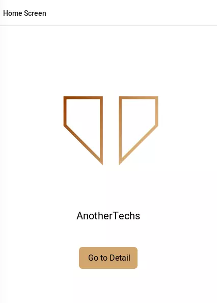

# A Comprehensive Guide to React Native Navigation Stack: Best Practices and Tips

React Native Navigation Stack is an essential component for building mobile applications using React Native. It provides a flexible and powerful navigation solution that can help you create intuitive and easy-to-use interfaces for your users.

In this comprehensive guide, we will cover everything you need to know about React Native Navigation Stack, including its best practices and tips. By the end of this article, you will have a solid understanding of how to use this navigation solution in your projects.


## React Native Navigation

React Native Navigation is a popular alternative to [React Navigation](https://reactnavigation.org/). It’s a module that is dependent on and designed to be used with React Native. React Native Navigation differs slightly in that it directly uses native navigation APIs on iOS and Android, which allows for a more native look and feel.

One of the key benefits of React Native Navigation Stack is that it provides a consistent and predictable user experience. Users can easily navigate between screens, and the navigation is smooth and seamless. Additionally, it allows you to customize the navigation bar and add animations to make your app look and feel more polished.

## React Native Stack Navigation

Your best friend is Stack Navigation. This is how you may make stacks of pages that allow you to automatically return to the previous one. You'll wind up with numerous layers throughout your project, and the 'Back' option is a lifesaver in terms of not having to programme it manually each time.

## Getting Started

Before we begain let's install the required dependencies for working with react native navigation

```bash
npm install @react-navigation/native @react-navigation/native-stack
```

After install dependencies we will install `react-native-screens` and `react-native-safe-area-context`.

```bash
expo install react-native-screens react-native-safe-area-context # if you  are using expo client
npm install react-native-screens react-native-safe-area-context # if you are using react-native directly
```

After install above packages we will start building our app.

We will create two screen **Home Screen** which the use will see whenever he/she opens the app and another **Detail Screen** which display information about the user.

First let's import our necessary libraries:

```jsx
import React from "react";
import { TouchableOpacity, StyleSheet, Text, View } from "react-native";
import { NavigationContainer } from "@react-navigation/native";
import { createNativeStackNavigator } from "@react-navigation/native-stack";
import { Image } from "react-native";
```

### Creating Native Stack Navigator

`createNativeStackNavigator` is a function that returns an object with two properties: Screen and Navigator. Both are React components that are used to configure the navigation. To describe route configuration, the Navigator should have Screen components as its children.

```jsx
function Home() {
  // TODO
}

function Detail() {
  // TODO
}

const Stack = createNativeStackNavigator();

function App() {
  //TODO
}
```

After creating stack navigator object, let's add different screen on top of our `Stack`:

```jsx
function Home() {
  // TODO
}

function Detail() {
  // TODO
}

const Stack = createNativeStackNavigator();

function App() {
  <NavigationContainer>
    <Stack.Navigator>
      <Stack.Screen name="Home Screen" component={Home} />
      <Stack.Screen name="Detail Screen" component={Details} />
    </Stack.Navigator>
  </NavigationContainer>;
}
```

The `NavigationContainer` component handles and stores our navigation tree and navigation state. This component must encompass the structure of all navigators. This component is normally rendered at the root of our project, which is often the component exported from `App.js`.

Now let's create our **Home Screen** and **Detail Screen**:

### Home Screen

```jsx
function Home({ navigation }) {
  return (
    <View style={styles.container}>
      <Image
        source={require("./assets/images/cover1.png")}
        style={{
          paddingTop: 100,
          width: 300,
          height: 300,
          borderRadius: 300 / 2,
        }}
      />

      <Text style={{ fontSize: 25, paddingTop: 50 }}>AnotherTechs</Text>

      <View style={{ paddingTop: 50 }}>
        <TouchableOpacity
          style={styles.Button}
          onPress={() => navigation.navigate("Detail Screen")}
        >
          <Text style={{ fontSize: 20, textAlign: "center" }}>
            {" "}
            Go to Detail {""}
          </Text>
        </TouchableOpacity>
      </View>
    </View>
  );
}

const styles = StyleSheet.create({
  container: {
    flex: 1,
    backgroundColor: "#fff",
    paddingTop: 100,
    alignItems: "center",
  },
  Button: {
    marginTop: 10,
    paddingTop: 15,
    paddingBottom: 15,
    paddingLeft: 15,
    paddingRight: 15,
    marginLeft: 30,
    marginRight: 30,
    backgroundColor: "#d4a56e",
    borderRadius: 10,
    borderWidth: 1,
    borderColor: "#fff",
  },
});
```

- **navigation props**: Every screen component in the native stack navigator receives the `navigation` prop.
- **navigate('Details')**: we then call `navigate` function with the name of the route we will like to move to.

**OUTPUT**:



### Detail Screen

```jsx
function Details({ navigation }) {
  return (
    <View style={{ flex: 1, alignItems: "center", paddingTop: 50 }}>
      <Image
        source={require("./assets/images/pexels-mustafa-ezz-925043.jpg")}
        style={{ width: 300, height: 300, borderRadius: 300 / 2 }}
      />
      <View style={{ flex: 1, justifyContent: "center" }}>
        <Text style={{ textAlign: "center", padding: 3, margin: 4 }}>
          Lorem ipsum dolor sit amet, consectetur adipiscing elit. Nullam
          laoreet metus faucibus orci vestibulum suscipit. Curabitur non
          bibendum ipsum, quis tristique sapien. Proin tempor tortor lectus, id
          dapibus nisi commodo vitae. Vestibulum lorem tortor, vulputate sit
          amet fermentum vehicula, porttitor vel libero. Praesent ipsum turpis,
          consequat non malesuada in, pretium a quam. Nunc fermentum a dolor in
          semper. Suspendisse venenatis nulla sed diam egestas rutrum.
          Suspendisse ut eleifend sapien. Suspendisse bibendum, quam in
          efficitur dapibus, dolor lectus consectetur arcu, vel efficitur sapien
          ipsum et augue. Vestibulum in tincidunt orci, a sagittis odio.
          Curabitur consectetur mi mauris, vel ornare arcu pellentesque vel.
          Quisque sagittis, erat nec vehicula facilisis, sem est aliquet dolor,
          sit amet iaculis nunc quam eu purus. Curabitur sit amet massa
          ultrices, ullamcorper risus vitae, accumsan enim. Sed et nisi eget
          nibh mattis auctor.
        </Text>
      </View>
    </View>
  );
}
```

When it is feasible to return from the active screen, the native stack navigator's header will automatically include a back button (if there is only one screen in the navigation stack, there is nothing that you can go back to, and so there is no back button).

**OUTPUT**:


## Final Thoughts

In conclusion, React Native Navigation Stack is a powerful and flexible navigation solution that can help you create intuitive and easy-to-use interfaces for your users. By following the best practices and tips outlined in this article, you can ensure that your app's navigation is smooth, predictable, and visually appealing. So, what are you waiting for? Start implementing React Native Navigation Stack in your projects today!

## References
* [React Native](https://reactnative.dev/): The official website of React Native, a JavaScript framework used for building native mobile applications.
* [React Navigation](https://reactnavigation.org/): A popular routing and navigation library for React Native apps.
* [React Native Animations](https://reactnative.dev/docs/animated): A guide to using animations in React Native apps.
* [React Native UI Components](https://reactnativeelements.com/): A collection of customizable UI components for React Native.
* [Expo](https://expo.dev/): A free and open-source platform for building and deploying React Native apps.