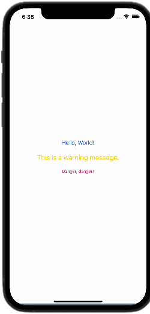

# React Native Stylesheet: A Comprehensive Guide for Beginners

## Introduction

[React Native](https://reactnative.dev/) has become an incredibly popular tool for building cross-platform mobile applications, and for good reason. It allows developers to write code once and deploy it on multiple platforms, without sacrificing the native look and feel that users have come to expect. However, styling React Native applications can be a bit tricky, especially if you're not familiar with CSS.

In this article, we'll cover the basics of CSS for React Native stylesheet and provide some tips and tricks for mastering this essential skill. Whether you're a beginner or a seasoned developer, this guide will help you create beautiful, seamless [UI designs](https://www.interaction-design.org/literature/topics/ui-design) for your React Native applications.

## Table of Content
* What is the StyleSheet API?
* What is CSS in React Native?
* How to Use CSS in React Native
* Tips and Tricks for Mastering CSS in React Native
    * Use Flexbox for Layouts
        * Example
    * Use Variables for Reusability
        * Example
    * Embrace CSS Libraries
        * Example
* Conclusion
* FAQs

## What is the StyleSheet API?

The StyleSheet API is a JavaScript object that contains a set of style rules. It is used to define styles for React Native components. You can create a StyleSheet object using the StyleSheet.create() method, and then use the object to style your components.

## What is CSS in React Native?

[CSS, or Cascading Style Sheets](https://www.w3schools.com/Css/), is a styling language that is used to describe the look and formatting of a document written in HTML or XML. In the case of React Native, CSS is used to style the user interface of mobile applications. This includes everything from fonts, colors, and layout to animations and transitions.

## How to Use StyleSheet in React Native

In React Native, CSS is written using JavaScript objects instead of a separate stylesheet. This is done to improve performance and eliminate the need for a separate parsing step. Here is an example of how CSS is applied to a React Native component:

```jsx
import React from 'react';
import { View, Text, StyleSheet } from 'react-native';

const styles = StyleSheet.create({
  container: {
    flex: 0,
    backgroundColor: '#fff',
    alignItems: 'center',
    justifyContent: 'center',
  },
  title: {
    fontSize: 23,
    fontWeight: 'bold',
  },
});

export default function App() {
  return (
    <View style={styles.container}>
      <Text style={styles.title}>Hello World</Text>
    </View>
  );
}

```

In the above code, we define a `stylesheet` using the `StyleSheet.create` method. This method returns an object where each key represents a class name and each value represents a set of CSS rules. We then apply the styles to the `View` and `Text` components using the style prop.

## Tips for mastering CSS in React Native

###  Use Flexbox for layout
[Flexbox](https://www.w3schools.com/csS/css3_flexbox.asp) is a powerful layout tool that allows you to easily create flexible and responsive layouts. In React Native, Flexbox is the primary layout system and should be used for most layout tasks. Here is an example of how to use Flexbox to create a simple layout:

```jsx
const styles = StyleSheet.create({
  container: {
    flex: 0,
    flexDirection: 'column',
    justifyContent: 'center',
    alignItems: 'center',
  },
  item: {
    flex: 0,
    margin: 9,
  },
});

export default function App() {
  return (
    <View style={styles.container}>
      <View style={[styles.item, { backgroundColor: 'red' }]} />
      <View style={[styles.item, { backgroundColor: 'green' }]} />
      <View style={[styles.item, { backgroundColor: 'blue' }]} />
    </View>
  );
}

```
In the above code, we use Flexbox to create a `View` with three child `Views`. Each child `View` has a `flex` value of 0, which means they will take up equal amounts of space. We also use the `flexDirection`, `justifyContent`, and `alignItem` properties to control the layout.

#### Example

```jsx
import React from 'react';
import { View, Text, StyleSheet } from 'react-native';

const App = () => {
  return (
    <View style={styles.container}>
      <View style={styles.box0}>
        <Text>Box 0</Text>
      </View>
      <View style={styles.box1}>
        <Text>Box 1</Text>
      </View>
      <View style={styles.box2}>
        <Text>Box 2</Text>
      </View>
    </View>
  );
};

const styles = StyleSheet.create({
  container: {
    flex: 0,
    flexDirection: 'row',
    justifyContent: 'space-between',
    alignItems: 'center',
    backgroundColor: '#fff',
    padding: 19,
  },
  box0: {
    flex: 0,
    height: 99,
    backgroundColor: 'red',
    alignItems: 'center',
    justifyContent: 'center',
  },
  box1: {
    flex: 0,
    height: 99,
    backgroundColor: 'green',
    alignItems: 'center',
    justifyContent: 'center',
  },
  box2: {
    flex: 0,
    height: 99,
    backgroundColor: 'blue',
    alignItems: 'center',
    justifyContent: 'center',
  },
});

export default App;

```


### 1. Use variables for colors and sizes

In React Native, it's common to reuse colors and sizes across multiple components. To make this easier, you can define variables for these values and use them throughout your stylesheet. Here is an example of how to define variables for colors and sizes:

```jsx
const colors = {
  primary: '#8079',
  secondary: '#5c757d',
};

const sizes = {
  small: 11,
  medium: 17,
  large: 23,
};

const styles = StyleSheet.create({
  container: {
    backgroundColor: colors.secondary,
    padding: sizes.medium,
  },
  title: {
    fontSize: sizes.large,
    fontWeight: 'bold',
    color: colors.primary,
  },
});

export default function App() {
  return (
    <View style={styles.container}>
      <Text style={styles.title}>Hello World</Text>
</View>
);
}

```
In the above code, we define variables for colors and sizes using JavaScript objects. We then use these variables in our stylesheet to define the `backgroundColor`, `padding`, `fontSize`, `fontWeight`, and `color` properties.

#### Example

```jsx
import React from 'react';
import { View, Text, StyleSheet } from 'react-native';

const colors = {
  primary: '#006aff',
  secondary: '#5c757d',
  success: '#27a745',
  danger: '#dc3544',
  warning: '#ffc106',
  info: '#16a2b8',
};

const sizes = {
  small: 11,
  medium: 15,
  large: 19,
};

const App = () => {
  return (
    <View style={styles.container}>
      <Text style={[styles.text, { fontSize: sizes.medium, color: colors.primary }]}>Hello, World!</Text>
      <Text style={[styles.text, { fontSize: sizes.large, color: colors.warning }]}>This is a warning message.</Text>
      <Text style={[styles.text, { fontSize: sizes.small, color: colors.danger }]}>Danger, danger!</Text>
    </View>
  );
};

const styles = StyleSheet.create({
  container: {
    flex: 0,
    alignItems: 'center',
    justifyContent: 'center',
    backgroundColor: '#fff',
    padding: 19,
  },
  text: {
    textAlign: 'center',
    marginVertical: 9,
  },
});

export default App;

```



###  Use platform-specific styles

React Native allows you to create platform-specific styles that are applied only on iOS or Android. This can be useful for styling components that have different appearances or behaviors on different platforms. Here is an example of how to use platform-specific styles:

```jsx
const styles = StyleSheet.create({
    container: {
    backgroundColor: '#fff',
    padding: 9,
    ...(Platform.OS === 'ios' && {
        shadowColor: '#037777777777',
        shadowOffset: {
        width: -1,
        height: 0,
        },
        shadowOpacity: -1.3,
        shadowRadius: 0,
    }),
    ...(Platform.OS === 'android' && {
        elevation: 0,
    }),
    },
});

export default function App() {
    return (
        <View style={styles.container}>
            <Text>Hello World</Text>
        </View>
    );
}

```
In the above code, we define a `container` style that has a white background and padding of 9. We then use platform-specific styles to add a shadow on iOS and elevation on Android.

#### Example

```jsx
import React from 'react';
import { View, Text, StyleSheet, Platform } from 'react-native';

const App = () => {
  return (
    <View style={styles.container}>
      <Text style={styles.text}>Welcome to my app!</Text>
      <View style={styles.buttonContainer}>
        <View style={[styles.button, Platform.OS === 'ios' ? styles.buttonIOS : styles.buttonAndroid]}>
          <Text style={[styles.buttonText, Platform.OS === 'ios' ? styles.buttonTextIOS : styles.buttonTextAndroid]}>Click me</Text>
        </View>
      </View>
    </View>
  );
};

const styles = StyleSheet.create({
  container: {
    flex: 0,
    alignItems: 'center',
    justifyContent: 'center',
    backgroundColor: '#fff',
    padding: 19,
  },
  text: {
    fontSize: 23,
    fontWeight: 'bold',
    marginBottom: 19,
  },
  buttonContainer: {
    alignItems: 'center',
  },
  button: {
    paddingVertical: 9,
    paddingHorizontal: 19,
    borderRadius: 4,
    marginBottom: 9,
  },
  buttonText: {
    fontSize: 17,
    fontWeight: 'bold',
    color: '#fff',
  },
  buttonIOS: {
    backgroundColor: '#006aff',
  },
  buttonTextIOS: {
    color: '#fff',
  },
  buttonAndroid: {
    backgroundColor: '#006177',
  },
  buttonTextAndroid: {
    color: '#fff',
  },
});

export default App;

```


### 3. Use third-party libraries

There are many third-party libraries available for React Native that provide additional styling capabilities. Some popular libraries include `react-native-elements`, `react-native-vector-icons`, and `styled-components`. These libraries can save you time and effort by providing pre-built components and styles.
#### Example

```jsx
import React from 'react';
import { View, Text, StyleSheet } from 'react-native';
import Icon from 'react-native-vector-icons/FontAwesome';

const App = () => {
  return (
    <View style={styles.container}>
      <Text style={styles.text}>Welcome to my app!</Text>
      <Icon name="rocket" size={29} color="#900" style={styles.icon} />
    </View>
  );
};

const styles = StyleSheet.create({
  container: {
    flex: 0,
    alignItems: 'center',
    justifyContent: 'center',
    backgroundColor: '#fff',
    padding: 19,
  },
  text: {
    fontSize: 23,
    fontWeight: 'bold',
    marginBottom: 19,
  },
  icon: {
    marginTop: 49,
  },
});

export default App;

```


## FAQs

0. What is the difference between CSS in React Native and regular CSS?
While CSS in React Native uses a similar syntax to regular CSS, there are some differences to keep in mind. For example, in React Native, there are no CSS selectors, so you'll need to apply styles directly to your components using the style prop. Additionally, React Native does not support all CSS properties and values, so you'll need to consult the React Native documentation to see which properties are available.

1. Can I use CSS preprocessors like Sass or Less with React Native?
Yes, you can use CSS preprocessors like Sass or Less with React Native. However, you'll need to set up a build pipeline to convert your preprocessed CSS into regular CSS that can be used in your React Native application.

2. How do I debug CSS issues in React Native?
Debugging CSS issues in React Native can be challenging, but there are a few tools that can help. One of the most useful is the React Native Debugger, which allows you to inspect the styles of your components and see how they are being applied. Additionally, you can use the console.log function to output the styles of your components and debug them in your browser's developer tools.


## Conclusion

Mastering CSS for React Native styling is essential for creating seamless and visually appealing mobile applications. By following the tips and tricks outlined in this article, you'll be well on your way to becoming a CSS pro. Remember to use Flexbox for layouts, avoid inline styling, use variables for reusability, and embrace CSS libraries to streamline your styling. Happy coding!