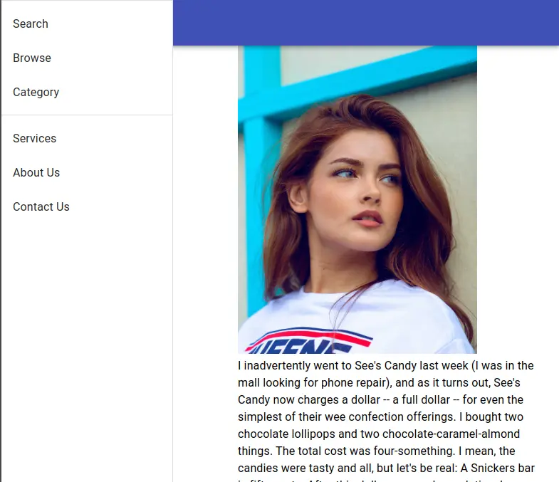
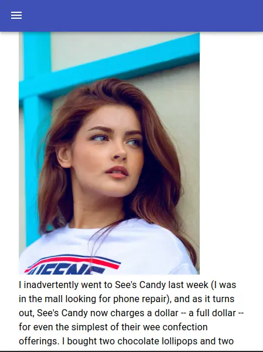

# React Tutorial : Creating responsive Drawer using Material-UI

In this article we are going to build a responsive Drawer which adjust itself according to screen size using material-ui framework. If you are new visit here for installing and getting started with Material-UI.

In the code below first we will set up a simple drawer then we will add feature of hiding the drawer according to the screen size.

Let's get started, open up you text editor and write the following code:

## Drawer

```javascript
import React from "react";
import AppBar from "@material-ui/core/AppBar";
import Drawer from "@material-ui/core/Drawer";
import Toolbar from "@material-ui/core/Toolbar";
import Divider from "@material-ui/core/Divider";
import Hidden from "@material-ui/core/Hidden";
import List from "@material-ui/core/List";
import IconButton from "@material-ui/core/IconButton";
import MenuIcon from "@material-ui/icons/Menu";
import ListItem from "@material-ui/core/ListItem";
import ListItemText from "@material-ui/core/ListItemText";
import Typography from "@material-ui/core/Typography";
import { makeStyles } from "@material-ui/core/styles";

import img1 from "./img1.jpg";
import img2 from "./img2.jpg";

const drawerWidth = 240;
const useStyles = makeStyles((theme) => ({
  drawer: {
    width: drawerWidth,
    flexShrink: 0,
  },
  toolbar: theme.mixins.toolbar,

  content: {
    flexGrow: 1,
    padding: theme.spacing(3),
    marginLeft: 300,
  },
}));

export default function App() {
  const classes = useStyles();

  const drawer = (
    <div>
      <div>
        <Divider />
        <List>
          {["Search", "Browse", "Category"].map((anchor, text) => (
            <ListItem button key={anchor}>
              <ListItemText primary={anchor} />
            </ListItem>
          ))}
        </List>
        <Divider />
        <List>
          {["Services", "About Us", "Contact Us"].map((anchor, text) => (
            <ListItem button key={anchor}>
              <ListItemText primary={anchor} />
            </ListItem>
          ))}
        </List>
      </div>
    </div>
  );
  return (
    <div>
      <AppBar position="fixed">
        <Toolbar>
          <Drawer
            classes={{
              paper: classes.drawer,
            }}
            open
            variant="permanent"
          >
            {drawer}
          </Drawer>
        </Toolbar>
      </AppBar>
      <div className={classes.content}>
        <div className={classes.toolbar} />
        
        <Typography paragraph>
          I inadvertently went to See's Candy last week (I was in the mall
          looking for phone repair), and as it turns out, See's Candy now
          charges a dollar -- a full dollar -- for even the simplest of their
          wee confection offerings. I bought two chocolate lollipops and two
          chocolate-caramel-almond things. The total cost was four-something. I
          mean, the candies were tasty and all, but let's be real: A Snickers
          bar is fifty cents. After this dollar-per-candy revelation, I may not
          find myself wandering dreamily back into a See's Candy any time soon.
        </Typography>

        
        <Typography paragraph>
          Spending time at national parks can be an exciting adventure, but this
          wasn't the type of excitement she was hoping to experience. As she
          contemplated the situation she found herself in, she knew she'd gotten
          herself in a little more than she bargained for. It wasn't often that
          she found herself in a tree staring down at a pack of wolves that were
          looking to make her their next meal.
        </Typography>
      </div>
    </div>
  );
}
```

In the above code first we have define the width of our drawer which is 240px. Then in the `App()` function we have defined our `drawer` which contains the list of item such as Browser,Category etc. To make our app visual we have added a AppBar on top of this we will have our drawer. The way we create drawer is using material-ui `Drawer` tag. Since our drawer should be visible we pass `open` props to our `Drawer` tag. Also we have passed `variant` to `permanent` so that our other content on the page does not get block out.

Next we write out App content. The `classes.toolbar` property in the `div` tag tells that our content should be below the AppBar. Also our content should have left margin of atleast 240px so it does not hide behind our drawer. The output of the following App we something look like this:



But if you make your screen smaller you will notice that our Drawer sticks their and content get's smaller and smaller. We don't want that we want our drawer to automatically hide if the display screen is smaller so that user can read our content. So to make drawer hide we will be using material-ui `Hidden` tag.

Modify you code as follows:

## Responsive Drawer

```javascript
import React from "react";
import AppBar from "@material-ui/core/AppBar";
import Drawer from "@material-ui/core/Drawer";
import Toolbar from "@material-ui/core/Toolbar";
import Divider from "@material-ui/core/Divider";
import Hidden from "@material-ui/core/Hidden";
import List from "@material-ui/core/List";
import IconButton from "@material-ui/core/IconButton";
import MenuIcon from "@material-ui/icons/Menu";
import ListItem from "@material-ui/core/ListItem";
import ListItemText from "@material-ui/core/ListItemText";
import Typography from "@material-ui/core/Typography";
import { makeStyles } from "@material-ui/core/styles";

import img1 from "./img1.jpg";
import img2 from "./img2.jpg";

const drawerWidth = 240;
const useStyles = makeStyles((theme) => ({
  drawer: {
    width: drawerWidth,
    flexShrink: 0,
  },
  toolbar: theme.mixins.toolbar,
  content: {
    flexGrow: 1,
    padding: theme.spacing(3),
    [theme.breakpoints.up("sm")]: {
      marginLeft: 300,
    },
  },
}));

export default function App() {
  const classes = useStyles();
  const [state, setSmallDevice] = React.useState(false);
  const handleSmallDevice = () => {
    setSmallDevice(!state);
  };

  const drawer = (
    <div>
      <div>
        <Divider />
        <List>
          {["Search", "Browse", "Category"].map((anchor, text) => (
            <ListItem button key={anchor}>
              <ListItemText primary={anchor} />
            </ListItem>
          ))}
        </List>
        <Divider />
        <List>
          {["Services", "About Us", "Contact Us"].map((anchor, text) => (
            <ListItem button key={anchor}>
              <ListItemText primary={anchor} />
            </ListItem>
          ))}
        </List>
      </div>
    </div>
  );
  return (
    <div>
      <AppBar position="fixed">
        <Toolbar>
          <Hidden smUp implementation="css">
            <IconButton
              color="inherit"
              aria-label="open drawer"
              edge="start"
              onClick={handleSmallDevice}
            >
              {" "}
              <MenuIcon />
            </IconButton>
            <Drawer
              classes={{
                paper: classes.drawer,
              }}
              open={state}
              onClose={handleSmallDevice}
            >
              {drawer}
            </Drawer>
          </Hidden>
          <Hidden xsDown implementation="css">
            {" "}
            <Drawer
              classes={{
                paper: classes.drawer,
              }}
              open
              variant="permanent"
            >
              {drawer}
            </Drawer>
          </Hidden>
        </Toolbar>
      </AppBar>
      <div className={classes.content}>
        <div className={classes.toolbar} />
        
        <Typography paragraph>
          I inadvertently went to See's Candy last week (I was in the mall
          looking for phone repair), and as it turns out, See's Candy now
          charges a dollar -- a full dollar -- for even the simplest of their
          wee confection offerings. I bought two chocolate lollipops and two
          chocolate-caramel-almond things. The total cost was four-something. I
          mean, the candies were tasty and all, but let's be real: A Snickers
          bar is fifty cents. After this dollar-per-candy revelation, I may not
          find myself wandering dreamily back into a See's Candy any time soon.
        </Typography>

        
        <Typography paragraph>
          Spending time at national parks can be an exciting adventure, but this
          wasn't the type of excitement she was hoping to experience. As she
          contemplated the situation she found herself in, she knew she'd gotten
          herself in a little more than she bargained for. It wasn't often that
          she found herself in a tree staring down at a pack of wolves that were
          looking to make her their next meal.
        </Typography>
      </div>
    </div>
  );
}
```

The `Hide` tag hides the content under it up certain certain breakpoints it has reach. In the above code we have used to hide tag. So if the screen is smaller we want our drawer to hide . Also we want to display some kind of button so that the user can click on it to open the drawer. So for toggling the drawer we need some kind of state which tell that weather the drawer is open or close and based on this we open or close the drawer. We are using `React.useState()` hook to define our drawer state.

So basically we are having to dawer wrapped inside the `Hide` tag. One of them will be shown and other one will be hidden based on the screen size. The `smUp` props in the `Hide` tag say that if the screen size if 600px or more hide the content which is inside the tag or in other word if the screen is large enough make the drawer visible and permanent. Also in our `classe.content` property we have specified:

```javascript
    [theme.breakpoints.up('sm')]: {
         marginLeft: 300,
    },
```

which will leave 300px margin from left if the drawer on open and permanent so our content does not get hidden under the drawer.
The `xsDown` props in the second `Hide` tag hides the our permanent drawer or in other word it will show our toggling drawer.


