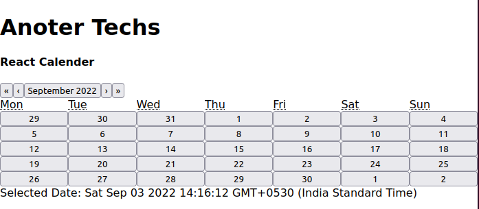
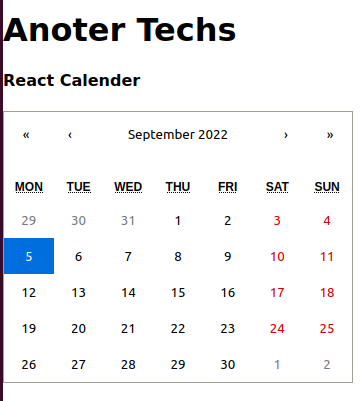
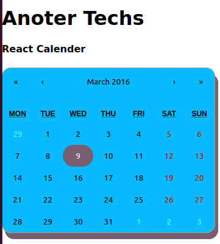
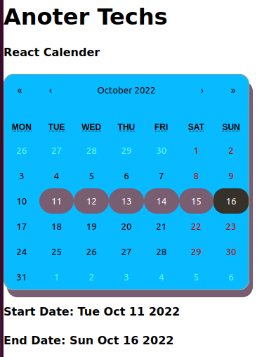

# React Calender

In your react web app, managing and modifying dates is a common task.  You may do things like add events or create reminders. You can do this by including a calendar in your web application. 

In this article, we'll look at how to make calendars in ReactJS. This calendar can be used in your to-do list, e-commerce site, ticket booking site, and a variety of other apps.


## What is react-calender 

React-Calendar is a simple calendar library that allows you to select days, months, years, and even decades.  For more complex use cases, it also supports date range selection and a variety of languages.

Because it is not dependent on [`moment.js`](https://momentjs.com/), React-Calendar is a very flexible and versatile library that can be used in almost any application. 

### Feature of react-calender

- Select from days, months, years, or even decades.

- Allows for the selection of a range

- It has the ability to support almost any language.

- Not dependent on `moment.js`

- JavaScript is needed. 

## Getting started with React Calender

Before implementing calender let us first create an project and install some dependencies.

### Creating a react project

To create an react project enter following in command in your built-in terminal:

```bash

npm create-react-app react-calender-example

```

This may take a few minutes; wait for the development environment to be installed. 

### Installing react-calender in your react project

To add react calender in your react project run the following command:

```bash

npm install react-calender

```

[Click Here](https://github.com/wojtekmaj/react-calendar) to see the list of all props which can be used with react-calender.


## react-calender example

**Boiler Plate Code**

```jsx
// app.js

import React,{useState} from 'react';
import Calendar from 'react-calendar';

const App = () => {

 const [date,setDate] = useState(new Date());

  return (
    <div>
        <div>
            <h1> Anoter Techs </h1>
            <h4> React Calendar </h4>
        </div>
        <div>
            <div>
                <Calendar onChange={setDate} value={date}/>
            </div>
            <div>
                Selected Date: {date.toString()}
            </div>
        </div>
    </div>
  );
};

export default App;

```

As in the above component you can see we have imported `Calender` component from `react-calender`.
We have also created a state variable `date` which will hold today's date. We have passed this state to to `value` props of `Calender` component.

The `onChange` props of calender component take `setDate` function which will change the `date` whenever use click on certain date.



## Styling react-calender

`react-calender` provides some default styling, which can be applied and used in react app. This file is located at `node_modules/react-calendar/dist/Calendar.css` and which can be imported as:

```jsx
import "react-calendar/dist/Calendar.css";
```

```jsx
import React,{useState} from 'react';
import Calendar from 'react-calendar';
import "react-calendar/dist/Calendar.css";

const App = () => {

 const [date,setDate] = useState(new Date());

  return (
    <div>
        <div>
            <h1> Anoter Techs </h1>
            <h4> React Calender </h4>
        </div>
            <div>
            <div>
                <Calendar onChange={setDate} value={date}/>
            </div>
        </div>
    </div>
  );
};


export default App;

```




## Styling react-calender with custom CSS

React-custom Calendar's styles have a decent appearance.  But we constantly aim for our parts to blend in with a product's overall design.  React-elements Calendar's already have some classes that we can utilise to apply our styles.

The ideal method for implementing your styling is to override `Calendar.css`. This can be done by first copying the default `Calendar.css` into your working project. For example:

```bash
cp ./node_modules/react-calendar/dist/Calendar.css ./src/Calender.css
```

Here the destination path should be your desired path where you want to put the `.css` file. After this all you need to do is to import this custom `Calender.css` file in you app.

```jsx
import React,{useState} from 'react';
import Calendar from 'react-calendar';
import "Calender.css";

......

```

**React Calendar Custom Style Example:**

```css
.react-calendar {
  width: 350px;
  max-width: 100%;
  background: #08baff;
  border: 1px solid #a0a096;
  border-radius: 15px;
  box-shadow: 5px 10px #795d70;
  font-family: Arial, Helvetica, sans-serif;
  line-height: 1.125em;
}
.react-calendar--doubleView {
  width: 700px;
}
.react-calendar--doubleView .react-calendar__viewContainer {
  display: flex;
  margin: -0.5em;
}
.react-calendar--doubleView .react-calendar__viewContainer > * {
  width: 50%;
  margin: 0.5em;
}
.react-calendar,
.react-calendar *,
.react-calendar *:before,
.react-calendar *:after {
  -moz-box-sizing: border-box;
  -webkit-box-sizing: border-box;
  box-sizing: border-box;
}
.react-calendar button {
  margin: 0;
  border: 0;
  outline: none;
}
.react-calendar button:enabled:hover {
  cursor: pointer;
}
.react-calendar__navigation {
  display: flex;
  height: 44px;
  margin-bottom: 1em;
}
.react-calendar__navigation button {
  min-width: 44px;
  background: none;
}
.react-calendar__navigation button:disabled {
  background-color: #f0f0f0;
}
.react-calendar__navigation button:enabled:hover,
.react-calendar__navigation button:enabled:focus {
  background-color: #e6e6e6;
}
.react-calendar__month-view__weekdays {
  text-align: center;
  text-transform: uppercase;
  font-weight: bold;
  font-size: 0.75em;
}
.react-calendar__month-view__weekdays__weekday {
  padding: 0.5em;
}
.react-calendar__month-view__weekNumbers .react-calendar__tile {
  display: flex;
  align-items: center;
  justify-content: center;
  font-size: 0.75em;
  font-weight: bold;
}
.react-calendar__month-view__days__day--weekend {
  color: #d10000;
}
.react-calendar__month-view__days__day--neighboringMonth {
  color: #5afff8;
}
.react-calendar__year-view .react-calendar__tile,
.react-calendar__decade-view .react-calendar__tile,
.react-calendar__century-view .react-calendar__tile {
  padding: 2em 0.5em;
}
.react-calendar__tile {
  max-width: 100%;
  padding: 10px 6.6667px;
  background: none;
  text-align: center;
  line-height: 16px;
}
.react-calendar__tile:disabled {
  background-color: #f0f0f0;
}
.react-calendar__tile:enabled:hover,
.react-calendar__tile:enabled:focus {
  background-color: #5afff8;
  border-radius: 15px;
}
.react-calendar__tile--now {
  background: #ffff76;
}
.react-calendar__tile--now:enabled:hover,
.react-calendar__tile--now:enabled:focus {
  border-radius: 15px;
  background: #ffffa9;
}
.react-calendar__tile--hasActive {
  background: #76baff;
}
.react-calendar__tile--hasActive:enabled:hover,
.react-calendar__tile--hasActive:enabled:focus {
  background: #a9d4ff;
  border-radius: 15px;
  box-shadow: 5px 10px #795d70;
}
.react-calendar__tile--active {
  background: #795d70;
  border-radius: 50px;
  
  color: white;
}
.react-calendar__tile--active:enabled:hover,
.react-calendar__tile--active:enabled:focus {
  background: #363129;
}
.react-calendar--selectRange .react-calendar__tile--hover {
  background-color: #e6e6e6;
}

```




## Date Range in react-calender

Date ranges are a feature of React-Calendar.  Users can choose a specific date range as a result of this.

Then you can provide some information that is within the user's desired date range. 

```jsx
import React,{useState} from 'react';
import Calendar from 'react-calendar';
import './calendar.css';

const App = () => {

 const [dates,setDate] = useState([new Date(2022, 9, 1), new Date()]);

  return (
    <div>
        <div>
            <h1> Anoter Techs </h1>
            <h4> React Calender </h4>
        </div>
        <div>
            <div>
                <Calendar onChange={setDate} selectRange={true} defaultValue={dates}/>
            </div>
            <div>
                <h4> Start Date: {dates[0].toDateString()} </h4>
                <h4> End Date:   {dates[1].toDateString()} </h4>
            </div>
        </div>
    </div>
  );
};


export default App;

```



In the script above, we gave our Calendar component a `selectRange` parameter.  The default setting for `selectRange` is false.  This value was updated to true.  The user can choose a date range thanks to this.


[React calendar](React-calendar) highlights the date range when a user selects a time frame to work with.

As our state, react-calendar then returns an array with two elements.  The start date and the end date are indicated by the two elements.  The array's start date and end date can then be printed. 

## React Calender Click Events

Numerous click event triggers are supported by React-Calendar. The most efficient props to support this are found in React-Calendar when you wish to trigger some function calls based on the user's action.  The most popular events are listed below. 


### `onChange`

This is the most common type of props used in react-calender. This function is invoked when a user clicks on an item in the most detailed view. 


### `onClickDay`

When user clicks on a particular day in react calender component this function gets triggered. Similar to `onClickDay`, react calender also support `onClickDecade`, `onClickMonth`, `onClickYead` etc.

### onViewChange

This function is invoked whenever the user switches between views by pressing the drill up button or clicking a tile. 


## Conclusion

We discussed adding the react-calendar package, customising it, setting a date range, and including a booking option in our react app.


Now that you know this information, you may use react to create a more dynamic and potent calendar. 


## References

- [react-calender](https://github.com/wojtekmaj/react-calendar)
- [code sandbox](https://codesandbox.io/s/n5kb8)
- [react js essential](https://amzn.to/3TWpZJ0)
- [ReactJS](https://amzn.to/3eronqn)
