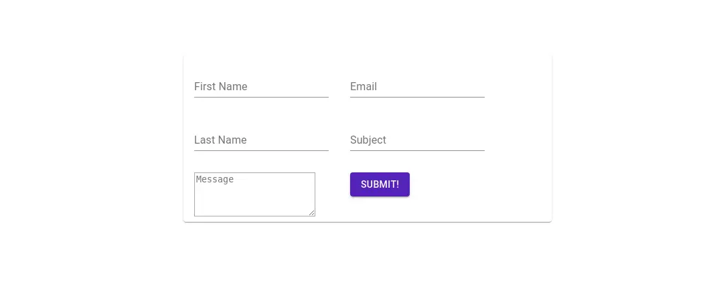

# React Tutorial - Creating a social card using Material UI

In this article we will create a simple social card using react's materail UI framework.

The idea is to create 3 statless component namely _SocialCard_,_CardFront_,_CardBack_. I will also be using flip animation so that whenever someone hover the mouse on my front component it get's flipped and show user the back side of the card.

- `SocialCard` : Main component which will render other components

- `CardFront`: Front side of our card which will consists of person detail.

- `CardBack`: Back side of our card which will consist of form which will have detail for contacting that person.

Now let's start writing the component:

### CardFront

```javascript
import React from "react";
import { makeStyles } from "@material-ui/core/styles";
import CardContent from "@material-ui/core/CardContent";
import Typography from "@material-ui/core/Typography";
import Card from "@material-ui/core/Card";
import CardMedia from "@material-ui/core/CardMedia";

const style = makeStyles((theme) => ({
  root1: {
    display: "flex",
    width: 550,
    height: 250,
  },
  details: {
    display: "flex",
    flexDirection: "column",
  },
  content: {
    flex: "1 0 auto",
  },
  photo: {
    height: 200,
    width: 200,
  },
}));

const CardFront = () => {
  const classes = style();
  const photo = require("../photo.jpg");
  return (
    <Card className={classes.root1}>
      <div className={classes.detail}>
        <CardContent className={classes.content}>
          <Typography variant="h2">Hatim Master</Typography>
        </CardContent>
        <CardContent>
          <Typography variant="caption" align="justify">
            <i> Computer Science Engineer </i>
          </Typography>
        </CardContent>
        <CardContent>
          <Typography variant="body2">
            Full Stack developer, Machine learning expert. Have work expieriance
            of more than 6 year
          </Typography>
        </CardContent>
      </div>
      <CardMedia className={classes.photo} image={photo} title="Hatim" />
    </Card>
  );
};

export default CardFront;
```

Here we used hook API(``makeStyle`) to change some changes of materil UI style.Then we have used `Card`component provided by material UI to display the content. For our fonts to good and presentable we will be using material UI`Typography`component. Finally to display the image in our card we use`CardMedia``` component.

OUTPUT:


### CardBack

```javascript
import React from "react";
import { makeStyles } from "@material-ui/core/styles";
import CardContent from "@material-ui/core/CardContent";
import Card from "@material-ui/core/Card";
import TextField from "@material-ui/core/TextField";
import TextareaAutosize from "@material-ui/core/TextareaAutosize";
import Button from "@material-ui/core/Button";

const style = makeStyles((theme) => ({
  root1: {
    display: "flex",
    width: 550,
    height: 250,
  },
  content: {
    flex: "1 0 auto",
  },
}));

const CardBack = () => {
  const classes = style();
  return (
    <Card className={classes.root1}>
      <div>
        <CardContent className={classes.content}>
          <TextField label="First Name" />
        </CardContent>
        <CardContent className={classes.content}>
          <TextField label="Last Name" />
        </CardContent>
        <CardContent className={classes.content}>
          <TextareaAutosize rowsMin={4} placeholder="Message" />
        </CardContent>
      </div>
      <div>
        <CardContent className={classes.content}>
          <TextField label="Email" />
        </CardContent>
        <CardContent className={classes.content}>
          <TextField label="Subject" />
        </CardContent>
        <CardContent className={classes.content}>
          <Button variant="contained" color="primary">
            {" "}
            Submit!{" "}
          </Button>
        </CardContent>
      </div>
    </Card>
  );
};

export default CardBack;
```

The back side of our card will content a form which will consist textfields in which user will write their information and a submit button. Again we have used React's [hook API] to change certain value of material UI. For input field we have used material's ``TextField` wrapper component. It is complete form control component including input,label and helper text.

### OUTPUT:



### SocialCard

** Card.css **:

```css
.card {
  transform: translate(-50%, -50%);
  position: absolute;
}
.front,
.back {
  overflow: hidden;
  backface-visibility: hidden;
  position: absolute;
  transition: transform 0.6s linear;
}
.front {
  transform: perspective(500px) rotateY(0deg);
}
.back {
  transform: perspective(500px) rotateY(180deg);
}
.card:hover > .front {
  transform: perspective(500px) rotateY(-180deg);
}
.card:hover > .back {
  transform: perspective(500px) rotateY(0deg);
}
```

```javascript
import React from "react";
import { makeStyles } from "@material-ui/core/styles";
import CardContent from "@material-ui/core/CardContent";
import Grid from "@material-ui/core/Grid";
import CardFront from "./CardFront";
import CardBack from "./CardBack";
import "./Card.css";

const style = makeStyles((theme) => ({
  root: {
    marginTop: 75,
    display: "flex",
    width: 550,
    height: 250,
  },
  content: {
    flex: "1 0 auto",
  },
}));

const SocialCard = () => {
  const classes = style();
  return (
    <Grid container justify="center" alignItem="cetner">
      <div className={classes.root}>
        <div className="card">
          <div className="front">
            <CardContent className={classes.content}>
              <CardFront />
            </CardContent>
          </div>

          <div className="back">
            <CardContent className={classes.content}>
              <CardBack />
            </CardContent>
          </div>
        </div>
      </div>
    </Grid>
  );
};

export default SocialCard;
```

This component bind the `CardBack` and `CardFront` component together. The `Grid` component of material UI is used to place the card at the center of the screen. For flipping animation we have used css `transition` and `transform` attributes.
