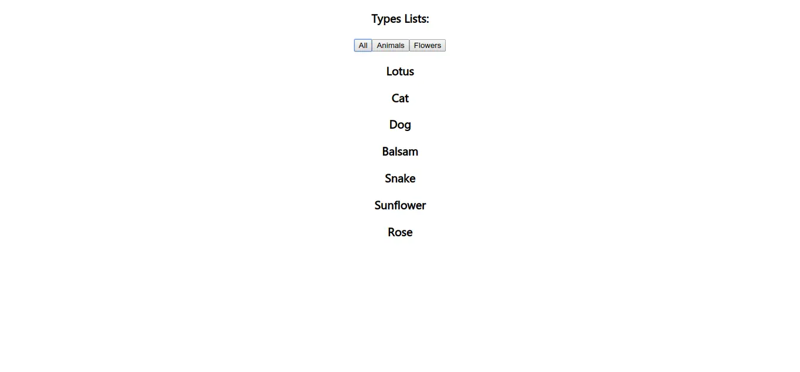

# React js components : Stateful vs stateless

**What is state ?**
State is an object which is declared inside the constructor method of the class.They are mutable and are used to interact between different component of the class.

## Statefull Components

Statefull components are the component which have state. They are created in constuctor method of the class. They are refered as class component and are extended by `React.Component`. Statefull component or container deal with the data which are frequently updated. Statefull component recieve both state and props. The state are mutable and are updated with `this.setState()` method of the class.

## Stateless Components

Statless component are static and often act like container in an app. These component only recieve props. They act upon the data which are pass to them as props.Stateless component are written as pure javascript function whoes parameter value does not change.Statless component are sometimes also referred as 'presentational component'. They are used when you know that the information is static and will never change.Whenever writting component we should always use statless component whenever possible.

## Statefull vs Stateless

The main difference between these state are that one has state and other does not. That means stateful component always used to track data which are frequently changing while stateless component prints out data which are passed to them as props or they will always render the samething.

Now let's look at example of statefull and stateless component.

First let's look at the data to be rendered:

```javascript
const data = [
  {
    type: "Flowers",
    kind: "Lotus",
  },
  {
    type: "Animals",
    kind: "Cat",
  },
  {
    type: "Animals",
    kind: "Dog",
  },
  {
    type: "Flowers",
    kind: "Balsam",
  },
  {
    type: "Animals",
    kind: "Snake",
  },
  {
    type: "Flowers",
    kind: "Sunflower",
  },
  {
    type: "Flowers",
    kind: "Rose",
  },
];
```

Now let's create our parent class or statefull class which will contain the state of this data.

```javascript
class Statefull extends React.Component {
  constructor(props) {
    super(props);
    this.state = { data: data };
  }
  clickToFileter(kind) {
    let types = [];
    if (kind === "all") {
      types = data;
    } else {
      types = data.filter((value) => {
        if (value.type === kind) return true;
      });
    }
    this.setState({ data: types });
  }

  render() {
    return (
      <div className="App">
        <h3> Types Lists: </h3>
        <button
          onClick={(e) => {
            this.clickToFileter("all");
          }}
        >
          {" "}
          All{" "}
        </button>
        <button
          onClick={(e) => {
            this.clickToFileter("Animals");
          }}
        >
          {" "}
          Animals{" "}
        </button>
        <button
          onClick={(e) => {
            this.clickToFileter("Flowers");
          }}
        >
          {" "}
          Flowers{" "}
        </button>
        {this.state.data.map((value, idx) => {
          return <Stateless key={idx} kind={value.kind} />;
        })}
      </div>
    );
  }
}
```

In above code I have given three button which will change the state of the component.
And this changed state is pass through `Statless` component as props which than display the content of the state.

```javascript
const Stateless = ({ kind }) => {
  return <h3>{kind}</h3>;
};
```

### OUTPUT:



### References

- https://yukcoding.id/stateful-stateless-component-react/
