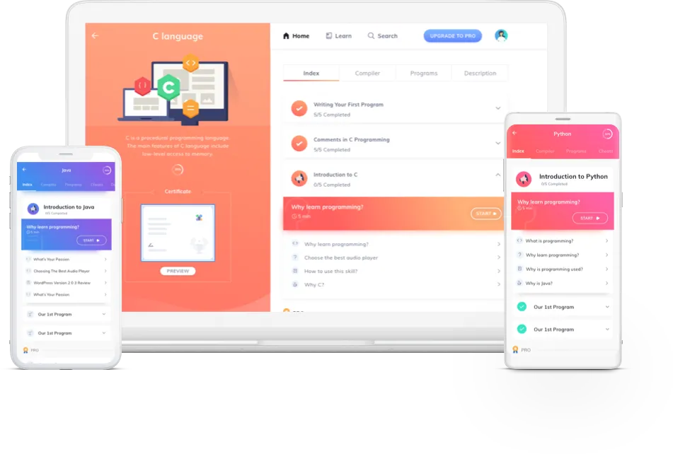
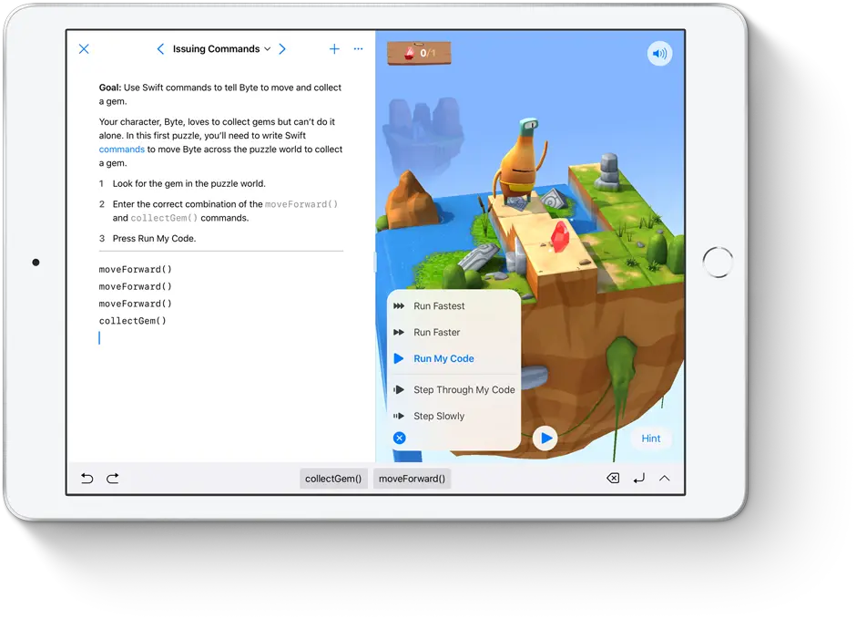
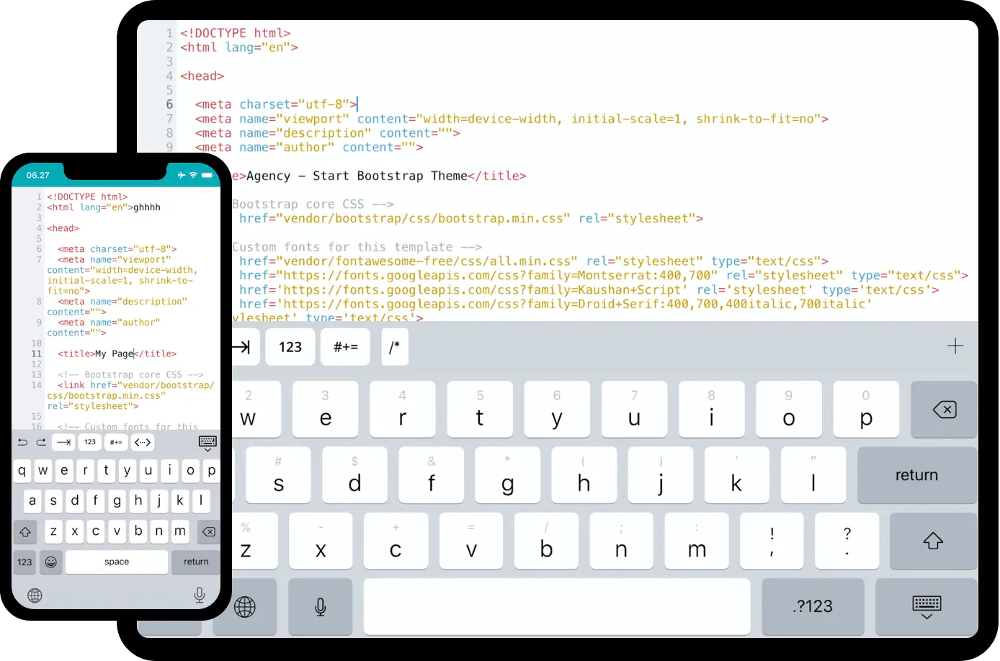
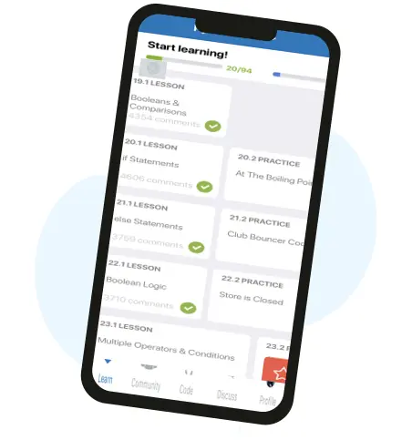
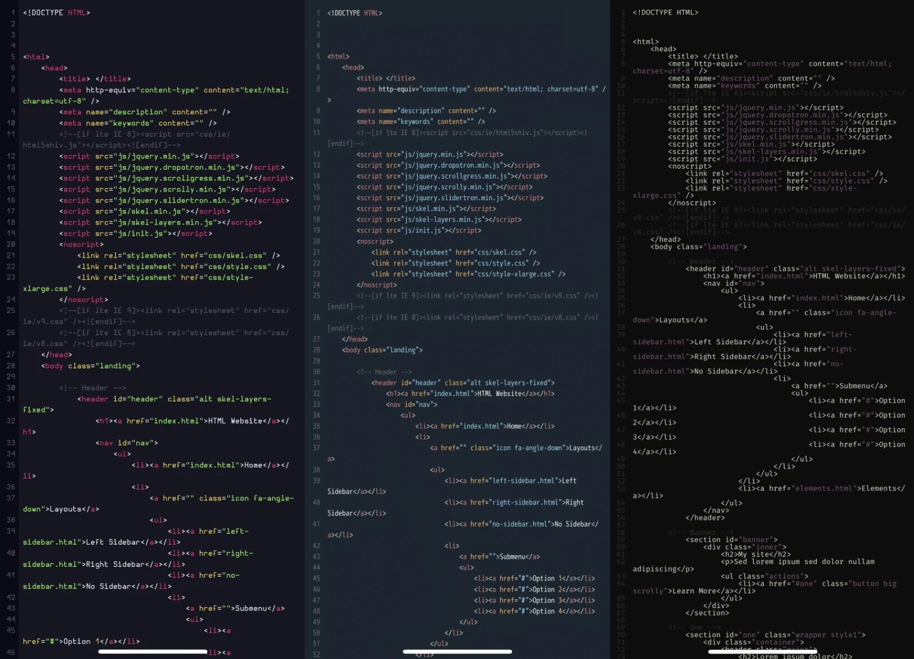
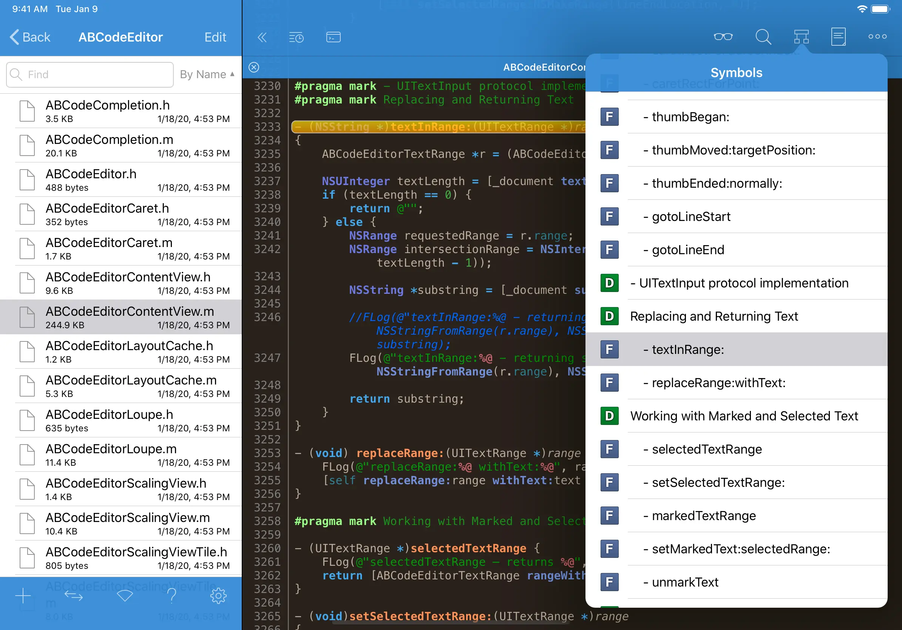
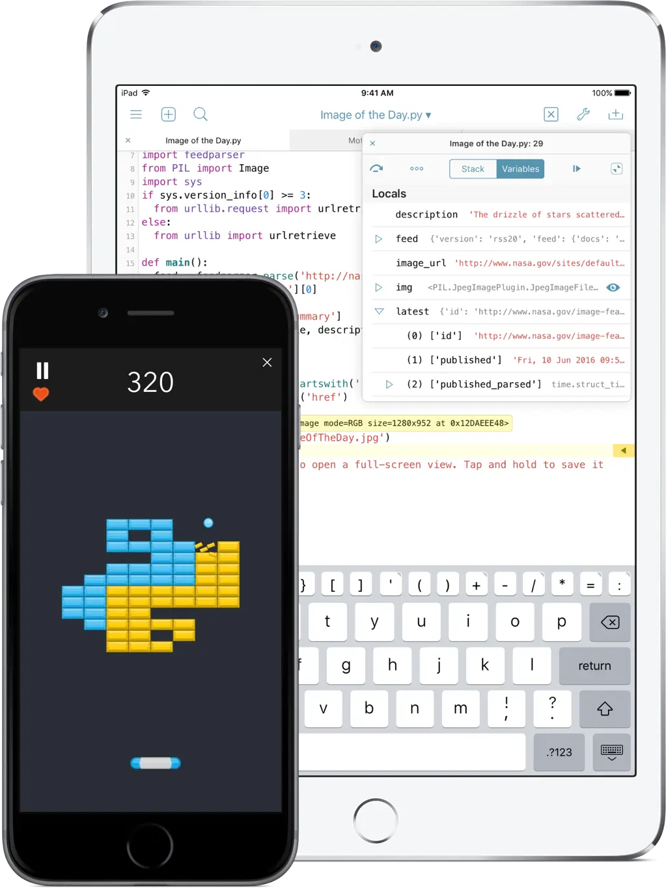
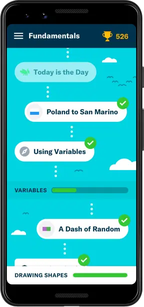
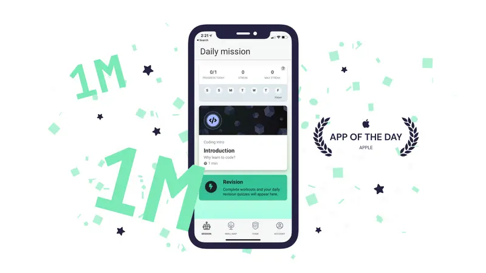
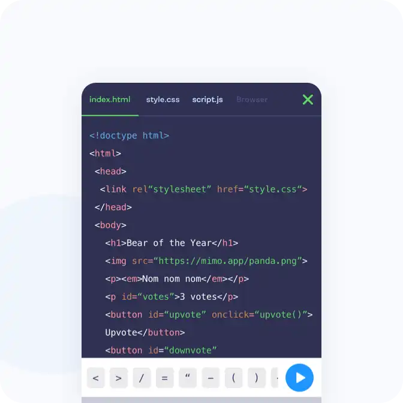

# Best Coding Apps for iOS and ipadOS

The code has led to some of the world's most innovative technologies. While all coders strive to enhance their skills, those who can code on the go will have an advantage over their competitors in this competitive field.

If you want to boost your chances of becoming a successful coder, use these apps for iOS and iPadOS.

## Programming Hub (Free, subscription available)

If you're interested in learning more than just coding, the [Programming Hub](https://programminghub.io/) app is a great choice. You can take lessons in artificial intelligence, IT principles, and coding, for example.

Descriptions of each lesson are included in the guide, as well as an estimate of the amount of money you may expect to earn after following the course. After each course, you can use a compiler to test your coding skills.

## Swift Playgrounds (Free)

Despite being exclusive to the iPad, [Swift Playgrounds](https://www.apple.com/swift/playgrounds/) is a fun and easy way to learn Apple's programming language. Students and developers can learn how to create their own apps on the platform by using the app.

While you're solving riddles using coding, the app also gives you access to an editor where you may create your own apps and games! If your app is accepted into the App Store, you'll be the first to know about it thanks to Swift Playgrounds. Using this application, which is absolutely free, you may learn how to develop better apps with Swift.

## Koder (Free)

[Koder](https://koderapp.com/) is a great tool for those who are already familiar with coding but wish to enhance their skills. This is one of the most comprehensive coding programmes, with more than 80 various programming languages.

Additionally, the software will help you write code that is more efficient and less likely to contain errors, in addition to providing syntax highlighting and auto-complete functionality.

This free programme for iOS and iPadOS makes file sharing for local and remote connections simple. As a result, you'll always be able to find the specific files you need when travelling.

## Sololearn (Free, subscription available)

[Sololearn](https://www.sololearn.com/home), which claims to have the largest library of online coding programmes, offers a large number of free coding classes. Examples include Python and C++. Java and jQuery

Every course you complete on the Sololearn platform comes with a certification that you can add to your LinkedIn page or CV. In addition to learning how to code, the app allows you to improve your skills by competing with other coders.

You'll need to upgrade to the premium edition of the app to access all courses and remove the ads.

## Buffer ($4.99)

A powerful editor will be needed when you're ready to code on the move, and [Buffer](https://buffereditor.com/) may be able to supply it. With this native iOS app, you can customise your UI with a variety of themes.

Improve the accessibility of your resources by connecting Buffer to services such as GitHub, DropBox, and many others. Syntax highlighting and auto-complete are available, exactly like in the other code editors on this list. It is possible to test your code on Safari when you are ready.

## Textastic ($9.99)

One of the industry's greatest full iOS development tools is [Textastic](https://www.textasticapp.com/). Koder's code editor allows you to write in more than 80 different computer languages, and this one is no exception. TextMate and Sublime Text 3 are also supported.

Based on native iOS and iPadOS APIs, the app has an advantage over other similar apps in terms of speed and responsiveness. It's possible to see the results of complex functions without any delays or problems. Textastic's suggested features include importing and exporting files, as well as cursor navigation for easy selection.

## Pythonista 3 ($9.99)

It's hard to find a better tool than [Pythonista 3](http://omz-software.com/pythonista/) for learning Python. Python coders will know many of the libraries, but it also contains native iOS capabilities like location data, contacts, reminders and images.

Pythonista 3 delivers desktop-like capabilities such as syntax highlighting, code completion, outline views, and multiple tab support on your mobile devices, so you won't have any trouble learning on the go.

## Grasshopper (Free)

A basic and easy-to-use software that runs in two ways, [Grasshopper](https://grasshopper.app/) will appeal to beginners who want to learn Javascript. Learn Javascript by answering multiple-choice questions or by writing code through exercises.

It starts off with simple missions, but as the game progresses they grow increasingly difficult. As you advance through the lessons, you'll receive real-time feedback and accolades for your work.

## Enki (Free, subscription available)

By employing flashcards, [Enki](https://www.enki.com/) can help you recall specific coding facts if you use it in conjunction with other iOS coding tools. Before asking you a question, Enki will offer you an informational card with code facts.

Despite the fact that Enki won't teach you how to code, it will allow you to contextualise your coding talents and support others in their learning

## Mimo (Free, subscription available)

Whatever your level of expertise, [Mimo](https://getmimo.com/) will keep you on track. It's a language-learning programme with a similar interface to Duolingo. You can get points based on how much you learn in a given day.

Mimo will create a collection of lessons that are specifically targeted to your needs based on your goals.

The app maintains track of how many consecutive days you've completed your classes in order to measure your progress.
The most common programming languages will be used to teach you how to code, and you'll gain new abilities by using different learning approaches.
