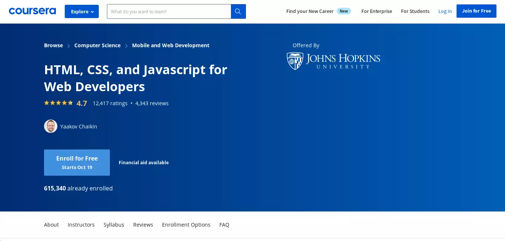
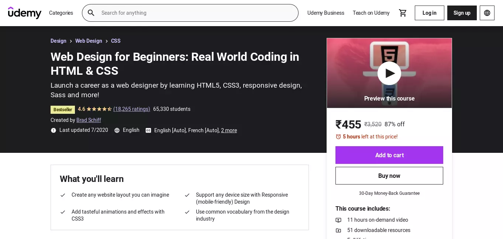
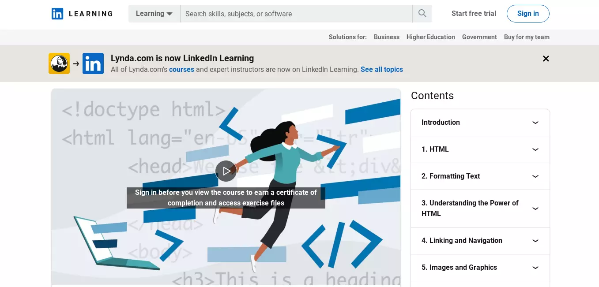
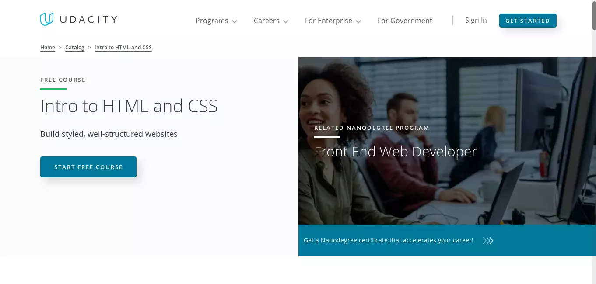
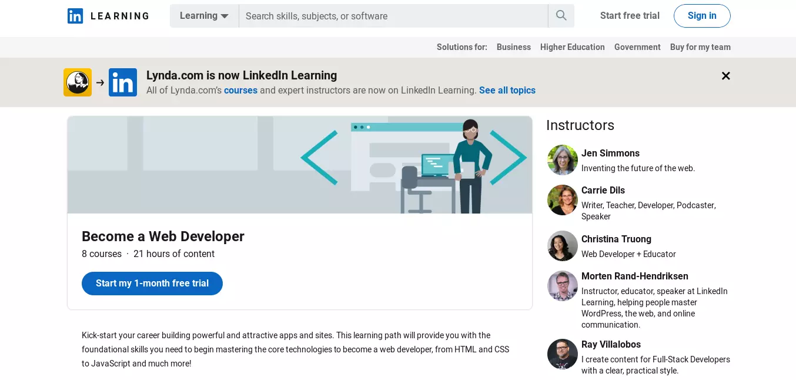
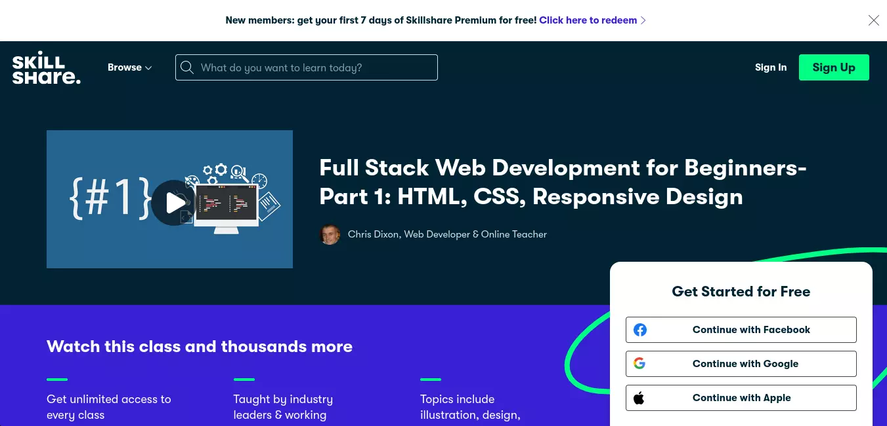

# Top HTML,CSS online courses for Beginner

From beginner to advanced, the top online courses for learning HTML and CSS will help you enhance your website design and development skills.

The essential coding languages for web design and development are HTML and CSS.
A working knowledge of these two is required if you need to execute any type of web modification activity.

HTML, or HyperText Markup Language, tells the web browser what each section of a website is, while CSS, or Cascading Style Sheets, aids in the appearance and formatting of the online pages.
Although there are many WYSIWYG (What You See Is What You Get) tools and services for creating websites, mastering HTML opens up a world of possibilities that no WYSIWYG editor can match.

Furthermore, HTML is only the beginning of a much broader universe, and it is useful for people in a variety of different fields, such as marketing and app development.

Web-based business apps, such as HTML, CSS, and JavaScript, are in high demand since they can operate natively on any mobile device.
It's no surprise, then, that the Bureau of Labor Statistics expects a double-digit increase in web developer positions over the next five years.

Here are some of the greatest courses to help you go from being an HTML noob to building your first web application.

## Coursera

HTML allows you to do a lot more than just construct webpages, as I indicated previously.
With the HTML, CSS, and Javascript for Web Developers course, you can take things a step further and learn how to construct web apps after you've put in some time and are comfortable writing HTML and designing it with CSS.

Johns Hopkins University offers a fairly complete course in this area.
Although it is part of the Ruby on Rails (RoR) specialisation, it may be taken alone and does not require any prior understanding of RoR.
This beginning course, unlike the previous one, covers HTML5, CSS3, the Twitter Bootstrap CSS Framework, and JavaScript, which the presenter characterises as "the programming language for the web."

The educator not only imparts practical knowledge, but also helps you understand why you're doing what you're doing.
The course will last approximately 30 hours and will be carried out over four weeks.
It contains video lessons, practise tests, and lists of suggested reading resources.
The instructor sits down with a real client to create a website for his restaurant based on the client's specifications, which is one of the wonderful features about the course that makes it stand out.

[Course Link](https://www.coursera.org/learn/html-css-javascript-for-web-developers)

## Udemy

Udemy offers an HTML course in which you will learn everything you need to know about web design, professional website development, producing large-scale project codes, and more.
Jonas Schmedtmann, a highly experienced and great web developer, designer, and teacher, will lead this course.
He has the top Udemy ratings and reviews, as well as a Master's degree in Engineering and a desire to educate.
This course will provide you with the most up-to-date information by providing on-demand videos, articles, and other resources.

The course has the following features:

1. You'll learn how to plan and code large-scale projects.
2. It will be possible to create stylish and responsive websites in a professional manner.
3. Methods for creating a quality website from the ground up that have been tried and tested.
4. Learn how to use jQuery to create effects like sticky navigation, animations, and scroll effects.
5. You can get a free eBook with all of the course material.
6. Full access to 11.5 hours of on-demand videos, seven supplement sources, and eleven articles that will vastly improve your knowledge and skills.

[Course Link](https://ekaro.in/enkr20220718s13184879)

## Linkdin Learning

When you've mastered the art of building websites for desktop and mobile platforms, it's time to include structured data to help improve the semantics of your site.
You may give your website a greater degree of depth by using structured data to better define its content.
The HTML: Structured Semantic Data course teaches you how to improve the readability of HTML code for search engines, web crawlers, and other user-engines.

The three-hour session looks at some of the most common structured data syntaxes and how to pick the correct one for you.
This is a relatively new course that covers organised semantic data well and in a way that other courses on the subject do not.

The course is targeted for structured data beginners and assumes you have a decent working knowledge of HTML.
It covers all of the commonly used structured data syntax, including Microformats, as well as how to interact with JSON-LD and gives extensive structured data examples.

[Course Link](https://www.linkedin.com/learning/html-essential-training-4?trk=learning-topics_learning-search-card_search-card&upsellOrderOrigin=default_guest_learning)

## Udacity

HTML is frequently regarded as a good starting point for programming since it teaches you how to think and interact like a coder.
If you've never programmed before, Udacity's Intro to HTML and CSS is a great place to start.
The Free course will not only teach you the fundamentals of HTML and CSS, but it will also expose you to broad programming principles and aid in the development of a programmer's vocabulary.

The training is well-paced and geared for complete novices.
It is structured into four lessons, the first two of which introduce HTML tags and the last two of which focus on CSS styling.
The course employs a combination of videos, written lectures, interactive quizzes, and workspaces to not only introduce tags but also to practise them right within the course.

Instead of introducing each and every HTML tag or CSS properties, the instructors encourage the use of reference resources like the HTML element reference on Mozilla’s Developer Network and the CSS-Tricks Almanac. They also introduce the developer tools built into the different browsers and give a primer on how you can use it to enhance your knowledge, which is a definite plus.

[Course Link](https://www.udacity.com/course/intro-to-html-and-css--ud001)

## Lynda( now linkdin )

Lynda gives a free lesson for those who are unsure about their ability to acquire knowledge and skills in computer language. Lynda allows newbies receive free access to hundreds of videos, course material, and articles.
However, if you require additional support or tutoring, you can pay a fee to use the facility.
This way, you'll be able to study and practise HTML for free, and you'll be able to choose whether or not to pay for more coaching if the need arises.

The program's highlight>s include:

1. Thousands of course materials and articles are available to you.
2. The entire course is available for free.
3. Additional assistance is available at a low cost.
4. You can also continue to learn other languages like CSS, HTML5, CSS3, JavaScript, and others.
5. Everyone is welcome to sign up for a free subscription.

[Course Link](https://www.linkedin.com/learning/paths/become-a-web-developer?trk=learning-serp_learning-search-card_search-card&upsellOrderOrigin=default_guest_learning)

## Skill Share

HTML is a simple language to learn, which explains why there are so many short courses available.
However, the Hand-Code Your First Website course, in my opinion, is great for someone who needs a crash education in HTML.
The instructor will not only provide you with the abilities to write your own website from scratch in under two hours, but he will do so utilising tools that are widely used in the development world.

To develop a simple one-page website for your favourite cartoon character, you'll use Sublime text editor and Google Chrome, which the instructor claims can help you discover HTML mistakes and even perform some design work in the browser itself.
He'll also devote some time to getting you acquainted with Git, GitHub, and the GitHub Desktop programme, which you'll use to host your code and publish your website.

Sure, the course will teach you how to construct CSS rulesets and expose you to a few key HTML components.
The fact that it teaches you how to approach a programming project sets it distinct from other similar services.
The instructor will emphasise and provide advice on how to plan a website, as well as a brief overview of debugging HTML code and some of the more prevalent sorts of errors.

[Course link](https://www.skillshare.com/classes/Full-Stack-Web-Development-for-Beginners-Part-1-HTML-CSS-Responsive-Design/1831372205?via=browse-rating-html-layout-grid)

## Finishing Up

The courses listed above were chosen by our panel of experts as among the best HTML courses to assist registrants obtain the new knowledge and skills they need to become experts in HTML and other languages.
These courses are available online, and you can access them at any time.
The websites listed are also excellent resources for learning HTML.
