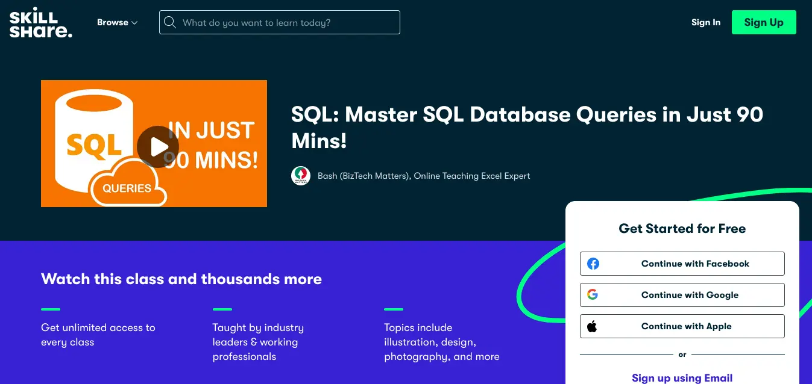
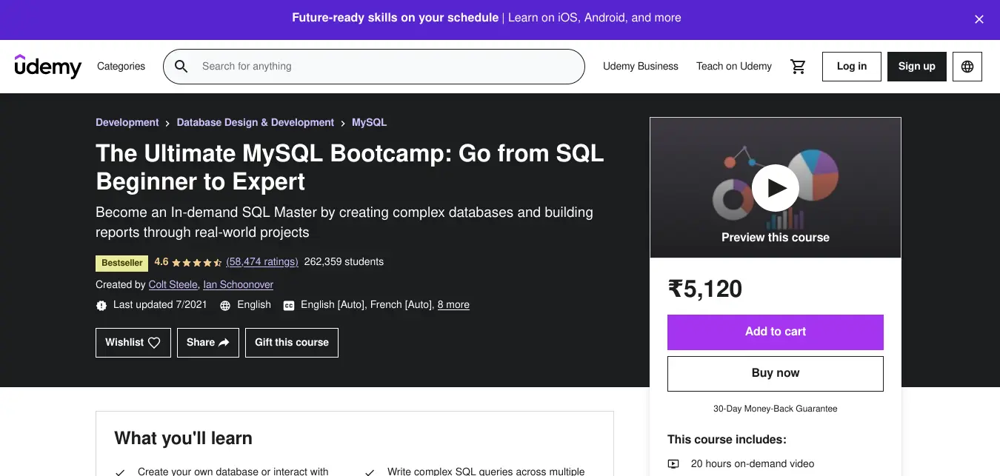
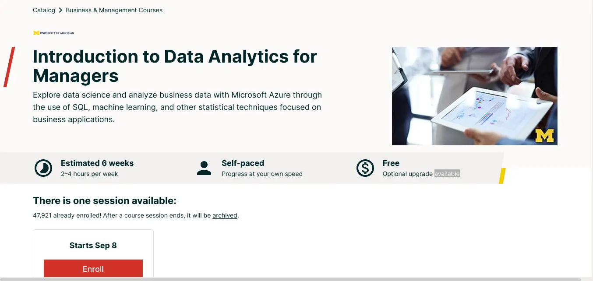
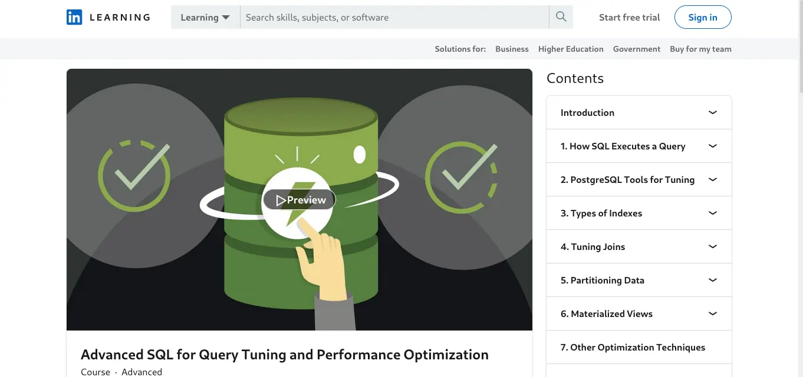
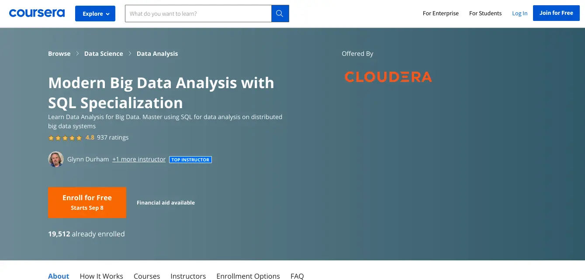

# Best SQL online courses To enroll 

Whether you're a beginner or an established user, the top online SQL courses make it straightforward and uncomplicated to increase your understanding in Structured Query Language (SQL).

The Structured Query Language, or SQL as it is more often known, is a database query language. While opinions differ on how to pronounce SQL, everyone seems to agree on its value, particularly in this age of big data and corporate analytics.

With businesses of all kinds churning out massive amounts of data, there's a growing demand for talents that can not only collect and store data, but also analyse it so that educated decisions can be made. SQL is a route to data science positions and one of the most important tools in a data scientist's toolbox.

SQL also works with a variety of relational database management systems, including MySQL, MariaDB, PostgreSQL, Microsoft SQL Server, Oracle Database, and others. And this is true regardless of whether your database is hosted in the cloud or on-premises.

So, whether you're a seasoned developer eager to learn something new or a SQL newbie, we've compiled a list of the top online courses to help you grasp SQL.

## SkillShare

Check out SkillShare's [Master SQL Database Queries](https://www.skillshare.com/classes/SQL-Master-SQL-Database-Queries-in-Just-90-Mins/1192226128) in Just 90 Minutes if you don't have much time and want a quick crash course on SQL. The presentation is just over an hour long, and the presenter makes the most of it by covering everything from single table queries to joins and subqueries. He gives a cursory look at how to create tables and update data within them before moving on to getting information. The courses are well-explained, and the problems at the end of each session are fairly useful, especially because he takes the time to explain all of the solutions, which is quite helpful.

The instructor executes the SQL queries using Firefox and the SQLite Manager add-on during the lesson. However, because the add-on is no longer compatible with current Firefox versions, the instructor now recommends DB Browser for SQLite, which is very comparable.

**Reasons to purchase**

- Succinct
- fast-paced

**Disadvantages**

- There are no subtitles or transcripts available.

## Udemy

[The Ultimate MySQL Bootcamp](https://ekaro.in/enkr20220718s13184861) course on Udemy is a great place to start if you're new to databases. The course is designed for total novices and includes over 20 hours of video. The course is divided into approximately 300 lectures that cover a wide range of topics in a reasonable amount of time. The instructor gently guides you through the process of installing the MySQL database and creating an Instagram-like database, which you'll then use to perform some real-world data queries.

Previously, the instructor recommended and used the online Cloud9 IDE, but now advises students to use the Goorm.io IDE, which is very comparable. He also demonstrates how to install MySQL on Windows and Mac OS X, but he advises that you do so at the end of the course.

After teaching you how to write SQL, the instructor guides you through the creation of a small web application. He uses Node.JS and the Express web development platform instead of the standard MySQL and PHP combination. While he does provide a crash course for individuals who have never worked with Node.JS before, keep in mind that this isn't the course's main focus.

**Reasons to purchase**

- Assumes no prior knowledge
- Covers a wide range of topics
- Is easily accessible

## Coursera

## edX

Data is all around us in business, and it has a lot of economic worth.
Take a look at the [Introduction to Data Analytics for Managers ](https://www.edx.org/course/introduction-to-data-analytics-for-managers)course if you want to develop skills that will help you do this.
The course is for managers who see the value of data analytics in the workplace but lack the skills to put it into practise.

The course, taught by the University of Michigan's Ross School of Business, combines a combination of lectures, business case studies, and hands-on exercises to introduce students to data analytics techniques and their applications in business.

You'll get a general understanding of data analytics and management tools and methodologies, as well as enough hands-on examples and activities to help you prepare for further in-depth courses on the subject. The course leverages the Azure ML Studio IDE, which is browser-based, and includes a dataset that you can load into the platform.

**Reasons to buy**

- Extremely detailed
- Well-structured

**Disadvantages**

- Very theoretical

## Linkdin Learning

There are a few SQL classes that focus on query optimization, despite the fact that there are many SQL classes accessible. When writing SQL queries in the real world, you want to make sure they're not just correct, but also efficient. There are a variety of ways to perform a query, but some are more efficient than others. You'll learn everything you need to know about query tuning and performance optimization in the [Advanced SQL for Query Tuning and Performance Optimization course](https://www.linkedin.com/learning/advanced-sql-for-query-tuning-and-performance-optimization).

The course starts with an overview of indexing, one of the most significant tools for query tailoring. It will then educate you about query plans, including how to translate a declarative query to a procedural execution plan, as well as data structuring and query crafting strategies for producing efficient execution plans.

Needless to mention, the course presupposes prior knowledge of SQL and does not cover the fundamentals.
Also, the trainer covers installation on Mac OS X and uses the PostgreSQL database in the training.

**Reasons to buy**

- Good concept coverage
- Query improvement plus
- Helpful hints

**Disadvantages**

- Not for novioces

## Coursera

If you're already comfortable with SQL and want to apply your knowledge to big data, [the Analyzing Big Data with SQL](https://www.coursera.org/specializations/cloudera-big-data-analysis-sql) course is for you. Cloudera provides the course, which can be audited for free.

The course assumes you have a basic understanding of SQL and builds on that foundation to teach you how to design SQL SELECT queries for data analysis. Although the instructor concentrates on two distributed big data SQL engines, Apache Hive and Apache Impala, the knowledge can be applied to regular RDBMS as well.

The course contains a virtual machine (VM) with everything you'll need to complete it. Make sure you read over the VM's hardware requirements before enrolling in the programme.

This is the second of three specialised courses.
If you need to brush up on big data topics and vocabulary, you can attend the previous course, which can also be audited for free.

**Reasons to purchase**

- Real-life examples
- Practical exercises
- Transcripts and Captions

**Disadvantages**

- VMs hardware requirement.
