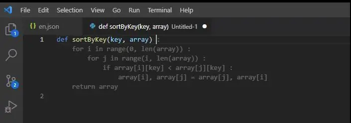
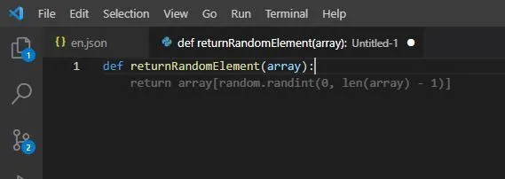

# What is GitHub Copilot- Everything you need to know

OpenAI and GitHub launched a technical preview for a new AI tool called **Copilot**. It lives within Visual Studio Code and autocompletes code snippets.

Copilot is more than just a parrot back program, GitHub says that this was the case before. Instead, it analyzes what you have already written and generates new matching codes, with specific functions that were once called. Automatically writing the code to import Twitter, draw scatterplots, or Get a Goodreads rating.

According to a blog article by Nat Friedman, it works best with Python, Go, Ruby, Javascript, and TypeScript.

## Features of GitHub Copilot

- **Convert comments into code**: Let GitHub Copilot assemble your code by leaving a comment.

- **Autofill**: GitHub Copilot is great for producing boilerplate quickly and repetitive code Patterns. Give it some examples, and it will generate your own!

- **Tests**: The backbone of any organization is the tests of a robust software engineering project. You can import a unit testing package. Let GitHub Copilot recommend tests that correspond to your implementation Code
- **Show me other options**: You might like to see a few? Different approaches? GitHub Copilot will provide a list of solutions. You can use the code as it is or modify it to suit your needs.

GitHub sees this as an evolution in pair programming. Two coders can work together on the same project in order to catch each other's mistakes. You can avoid making mistakes and accelerate the development process. Copilot is one of the best tools for managing your development projects.

This is the first major outcome of Microsoft’s $1 billion investment in **OpenAI**. OpenAI is the research company now headed by Sam, a former president of Y Combinator Altman. Altman has taken the reins of OpenAI. Status to a "capped profit" model. Microsoft invested and began licensing its GPT-3 text generation algorithm.

Copilot uses an algorithm called OpenAI Codex. OpenAI CTO Greg Brockman refers to as a descendant from GPT-3.

GPT-3, OpenAI's most popular language-generating algorithm is available. This can produce text that is sometimes unrecognizable from human writing. It is able to write convincingly due to its sheer volume (175 billion parameters) or flexible knobs, which allow the algorithm to link letters, words, phrases, and sentences.

GPT-3 generates English; OpenAI Codex generates code. OpenAI plans to release Codex via its API, later Developers will be able to build their own apps using the technology this summer.

The codex was trained with terabytes of openly accessible code pulled from GitHub as well as English language.

## Examples ScreenShot

Visual Studio Code will send comments and code written by the developer, GitHub Copilot service synthesizes and recommends the implementation. The service is optimized to work with small groups according to GitHub. Functions with meaningful names for parameters such as the sortByKey returnRandomElement above.

### Refrences

- https://copilot.github.com/
- https://www.infoq.com/news/2021/07/github-copilot-pair-programmming/
- https://www.kdnuggets.com/2021/07/github-copilot-ai-pair-programmer.html
