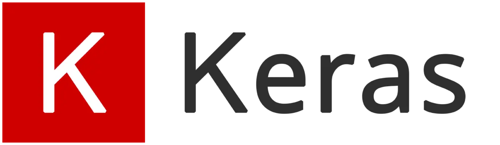
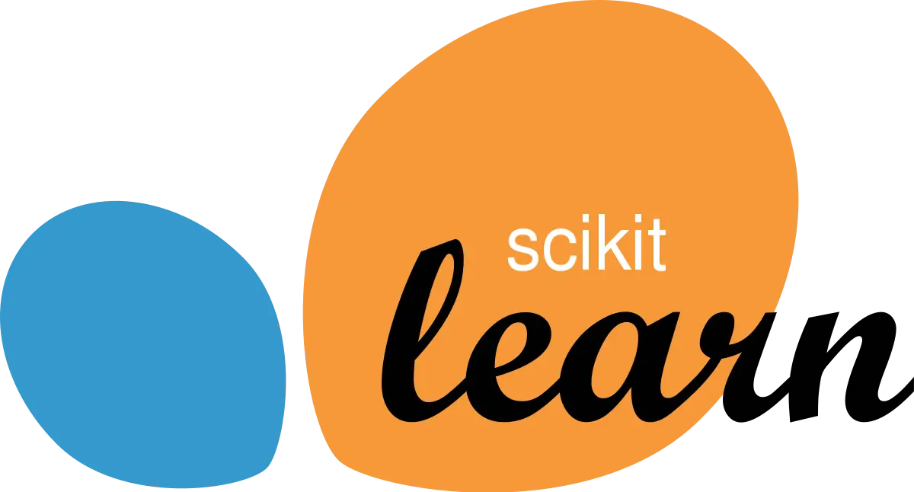

# 7 Best Machine Learning Libraries You Should Know in 2021

Machine learning is currently the most talked-about topic in artificial intelligence.

Engineering, medicine, business, social science, and other professions are all affected.

Machine learning is easier than ever using today’s machine learning libraries, which include Python, C++, Java, Julia, and R, among others.

If you want to get started in this exciting field, here are some prominent machine learning libraries to look at.

## 1. Pytorch

[Pytorch](https://pytorch.org/) was created by Facebook and launched in 2016.

Pytorch is an open-source library based on the Torch framework that is well-known for its extensive use in computer vision, deep learning, and natural language processing.
Pytorch, like Keras and Tensorflow, allows you to process datasets on the CPU.

In addition, if your dataset is huge, they include a GPU processor to execute your calculations.
It’s also tensor-based.
The library now offers C++ and Java bindings besides Python.

Torchvision, torchtext, torchaudio, and TorchServe are among Pytorch’s subsidiary libraries, besides other utilities.
These libraries are part of Pytorch’s machine learning capabilities, and you’ll encounter them while developing Pytorch models.
Pytorch is simple to comprehend, as long as you’re familiar with machine learning ideas, thanks to its comprehensive tutorial-based documentation.

You can also use Pytorch to convert your datasets into a machine-readable format.
As a result, it’s an ideal package for data preparation.
Pytorch can always perform feature extraction, data cleaning, data splitting, and hyper-parameter tweaking.

## 2. Keras

[Keras](https://keras.io/) is a machine learning library included in TensorFlow.
However, it differs because it is a higher-level API that comes packaged with TensorFlow.
It’s also more human-friendly and Python-based.
As a result, it is more implementable since it provides clear documentation that is easy to narrow down for machine-learning newbies.

Keras has a wide range of machine learning capabilities, making it ideal for training both organised and unstructured data.

For training and testing your dataset, however, the package includes text and image-based algorithms.
A unique feature of Keras is that it keeps you focused on the library, as it provides everything you need for your project in one piece. So you’ll hardly need to branch out to borrow utilities from other libraries. Hyper-parameter tuning, feature selection, rich data preprocessing layers, and data cleaning are some of its spectacularly built-in features.

With Keras, you can read images and texts directly from split folders in a parent directory and get a labeled dataset from them. And if your data is large and doesn’t sit in your machine memory, Keras offers a high-performance dataset object option. You can always switch to that.

## 3. TensorFlow

[TensorFlow](https://www.tensorflow.org/), which was introduced by Google in 2015, is more of a framework than a library.
It’s a C++-based open-source library that operates by tracking dataflow graphs.
TensorFlow is a powerful and adaptable tool that comes with several other built-in, unitary libraries for doing machine learning calculations.

TensorFlow is a scalable platform for developing machine learning ideas such as artificial neural networks (ANN), deep neural networks, and deep learning.

In addition to Python, Tensorflow also supports Java, C++, Julia, Rust, Ruby, and JavaScript.

While we may use TensorFlow with programming languages other than Python, using its cores with Python is easier because it completely supports TensorFlow’s implementation.
If you need to switch versions later, development pipelines in other languages may cause API version compatibility issues.
Unlike Keras, TensorFlow's documentation is comprehensive, yet it may be too diverse for beginners to understand.

However, it has a powerful community behind it, and there are many open-source TensorFlow examples available.
TensorFlow has a benefit over Keras in that it may be used directly without Keras.

Of course, because Keras is a branching class of TensorFlow, you can’t say the same for it.

## 4. mlpack

[mlpack](https://mlpack.org/) was released in 2008 and was written in C++ using the Armadillo linear algebra framework.

It, like Mlib Spark, allows you to use succinct and legible lines of code to apply most of the existing machine learning techniques and concepts straight to your dataset.

It enables CLI execution, which allows you to run your code and obtain instant replies, besides being available in programming languages like Python, C++, Go, and Julia.
Although it enables binding with several other languages, utilising mlpack with another programming language on huge datasets that require complicated calculation may not be the best choice.

As a result, mlpack’s scalability with languages other than C++ is frequently an issue.
If you’re a machine learning newbie who knows C++, you can still give it a shot.
For various programming languages, there are easy-to-follow guidelines and examples available in the documentation.

Mlpack employs low-level code to conduct difficult to simple machine learning tasks quickly since it runs calculations using C++ principles.

## 5. Scikit-Learn

[Scikit-learn](https://scikit-learn.org/stable/index.html), sometimes known as sklearn, is a Python-based machine learning framework that was first released in 2010.

The library is useful for a variety of machine learning tasks, including the modelling of both featured and unfeatured datasets.

Right out of the box, Scikit-learn includes supervised techniques such as linear and logistic regression models, support vector machine (SVM), Naive Bayes, Decision Trees, and Nearest Neighbors, among others.

It also contains a wealth of unsupervised learning methods, such as clustering, the Gaussian model, neural network models, and more.
Both supervised and unsupervised models are supported by scikit-learn.
Because it’s totally Python-based, it’s an excellent place to start if you’re new to Python or machine learning.

If you’re new to machine learning or data science, start using scikit-supervised learn’s learning features.
It is, on the whole, more beginner-friendly than the other libraries on this list.

Scikit-learn, unlike the other libraries described before, is heavily reliant on Numpy and Scipy to conduct high-performance mathematical calculations.
It also makes use of Matplotlib to create engaging story-telling graphics.

## 6. Mlib Spark

Here’s something from Apache Spark that you might find useful.

[Mlib Spark](https://spark.apache.org/mllib/), which was released and declared open-source in 2010, runs machine learning algorithms using iterative calculations.

Mlib may use Hadoop or local data sources and workflows because of its iterative nature.
It also has the ability to run sophisticated logic in a short amount of time.

In the end, it remains one of the quickest machine learning libraries available.
It can do regression, clustering, classification, and recommendation models, among other machine learning algorithms.

In terms of data preparation and pattern mining, it also shines.
The library is flexible, providing an API that works with Scala, Python, R,

Because Mlib Spark is a Spark embed, it updates with each Spark release.
Mlib Spark comes with detailed documentation, so even a novice may quickly learn how to use it.

However, one disadvantage is that it only supports a few programming languages, which may be a problem if you are unfamiliar with the languages it currently supports.

## 7. Theano

If you’re looking for a library that will help you break down troublesome issues into flexible algorithms, Theano is a good option.

[Theano](https://github.com/Theano/Theano) is a strong library for running tiny to high-performance calculations that was created in 2007 by Yoshua Bengio in Montreal, Canada.
Theano, like Scikit-Learn, uses Numpy to do numerical calculations.
The library generates low-level C code and supports GPU-based computations.

This allows Theano to perform mathematical calculations faster, no matter how large they are.

Tensors are also used in its deep learning algorithms.
Regardless of the data type, you may transform your dataset to legible float, binary, or integer points with Theano.

However, you may not receive adequate community support.
Because Theano isn’t as well-known as the other libraries we described earlier, this is the case.

That doesn’t make it any less approachable for newcomers.
The lesson in the manuals is simple to follow.
It is ideal for developing scalable machine learning models because of its ability to simplify complex arrays and optimise infinite computations.

### Which libraries you should learn ?

Although we’ve covered some of the most popular machine learning libraries, picking the best one might be difficult because they all serve very similar objectives and have only a few distinctions in their capabilities.

If you’re just getting started, starting with a beginner-friendly library like Scikit-Learn or Keras is a good idea.

Aside from that, selecting a library specifically for a project can help you reduce the number of complications in your development pipeline.

However, studying the principles of machine learning through classes and tutorials is beneficial.
