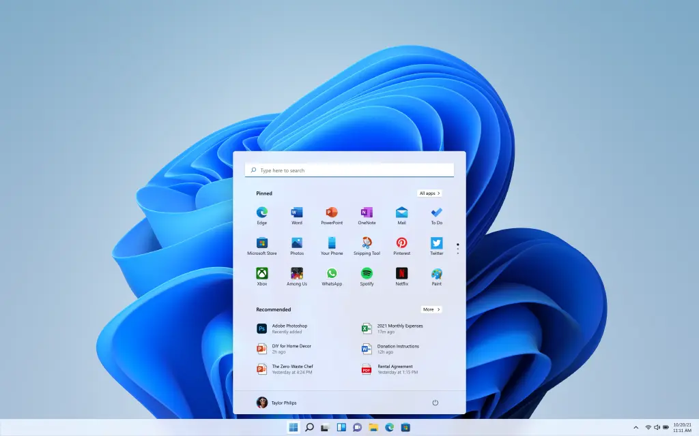
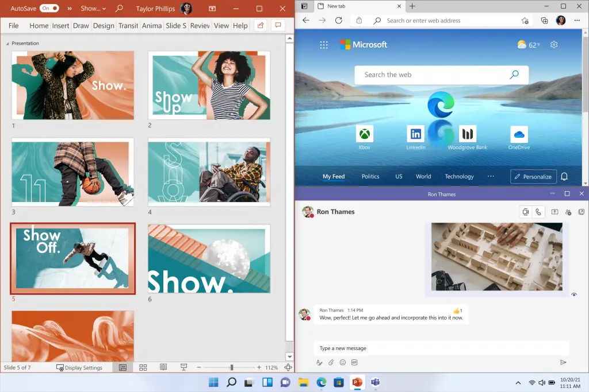
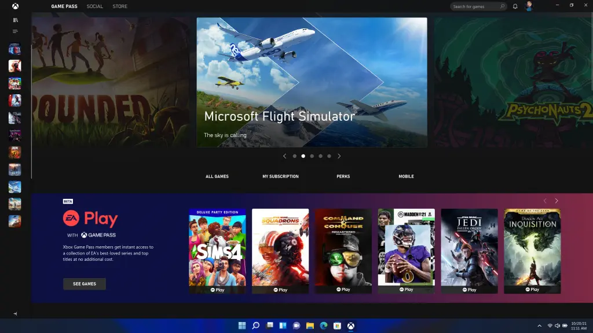
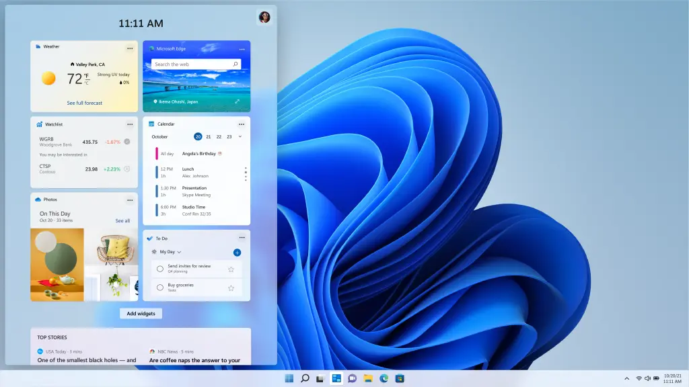
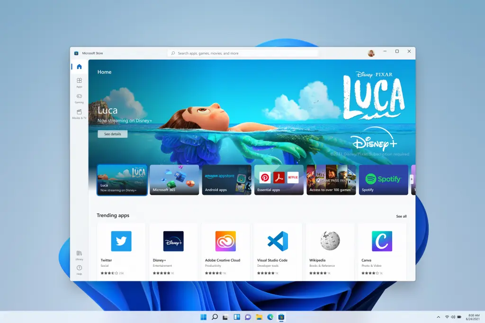
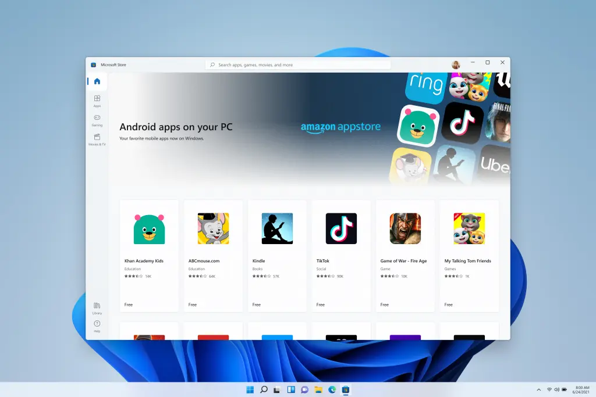

# Windows 11 - All new features

Windows has always been the scene of global innovation. It has always been the backbone of global companies and a place where aggressive startups have become household names. Many of us wrote our first email here, played our first PC game, and wrote our first line of code. Windows is where people create, connect, learn, and achieve - a platform trusted by more than a billion people today.

[Microsoft](https://www.microsoft.com/en-in) has now announced its new release [Windows 11](https://www.microsoft.com/en-us/windows/windows-11). With this release, windows come with tons of new features. Here are some of those features:

## A new UI design

Microsoft has redesigned the UI to increase users' experience It is modern, fresh, clean, and looks awesome. From the new windows home button and taskbar to every sound, font, and icon, everything is beautifully designed to keep you in check and give you a sense of calm and relaxation.

Windows has always tried to help you work the way you want by providing the flexibility of multiple windows and the ability to capture applications side by side. As of Windows 11, Microsoft has introduced Snap Layouts, Snap Groups, and Desktops to provide a more powerful multitasking method that allows you to keep track of what you need to do.

## Integration of Microsoft Teams into the Taskbar

In Windows 11, Microsoft introduces Microsoft Teams Chat in the taskbar. Now you can instantly connect with all your personal contacts via text, chat, voice or video anytime, anywhere, no matter what platform or device they use on Windows, Android, or iOS. **If the person you connect with, on the other end has not downloaded the Teams app, you can still contact them via two-way text messages.**

## Improved Gaming experience

If you are a gamer, Windows 11 is for you. Windows 11 unleashes the full potential of your system hardware, allowing some of the latest gaming technologies to serve you.

For example:

DirectX 12 Ultimate, which can achieve stunning, immersive graphics at high frame rates; DirectStorage can achieve faster loading times and more detailed game worlds; and Auto HDR provides a wider and more vivid color gamut for a truly fascinating viewing experience.

## New and faster widgets

Windows 11 brings you closer to the news and information that matters to you through a new and faster widget - a new personalized feed, backed by world-class browser performance provided by AI and Microsoft Edge. We often use mobile phones to check the news, the weather, or notifications. Now you can open a similar planning view directly from the desktop. When you open a custom feed, it slides across your screen like a piece of glass, so it doesn't interfere with what you're doing. For creators , widgets will open up a new space in Windows to provide personalized content.

## New Microsoft Store

The new Microsoft Store has been redesigned to increase speed and has a new design that is beautiful and easy to use. Not only it offer you more apps than ever, but also make all content - apps, games, shows, movies - easier to search and discover through curated stories and collections.

## Running Android apps on windows

Microsoft has announced that it will introduce Android applications to Windows for the first time. Starting later this year, people will be able to discover Android applications in the Microsoft Store and download them through the Amazon Appstore.
