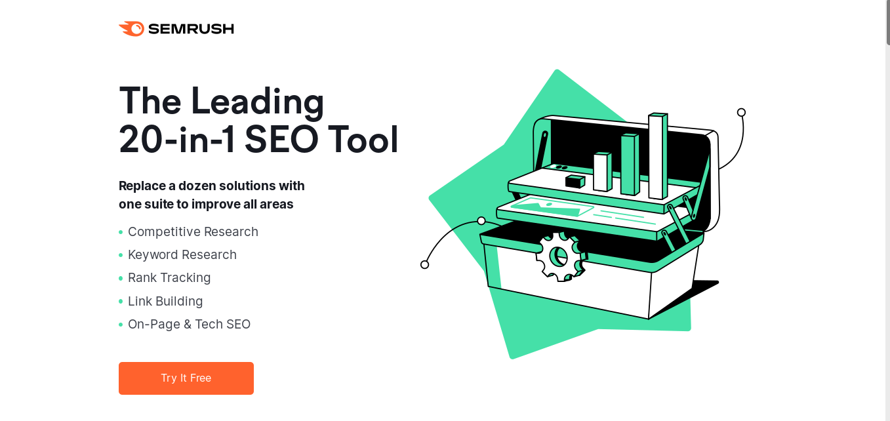

## Best Social Media Automation Tools

In the previous two decades, marketing has changed dramatically.To achieve customer loyalty, businesses must now be able to think on their feet.According to social media statistics, automation of digital marketing techniques, particularly social media, is critical.

This will free up time for you to focus on what really matters: your business.In addition, you may choose from a variety of social networking platforms to make your marketing efforts more seamless.

In this piece, we'll go through number of social media automation tools that will help you improve your marketing and grow your business.

## SEMrush

SEMrush is a digital marketing software that specialises in SEO and PPC management.
It does, however, provide a Social Media Toolkit, which allows for automated posting, tracking, promotion, and analytics across all major social media platforms.

### Social Media Poster

The Social Media Poster tool allows you to prepare and schedule your Facebook, Twitter, Instagram, Pinterest, and LinkedIn posts up to a week ahead of time, and it will automatically post them at the appropriate time.

You can check a post's performance after it has been published, and if it seems good, you can reschedule it as a one-time post or add it to a repeating queue.

You may also add five RSS feeds to the Social Media Poster to automatically capture the most recent content from other websites.

You can go over the content ideas that have been gathered and add them to your queues for automatic
publishing.

### Social Media Tracker

The Social Media Tracker tool works in the background, checking and aggregating all of your important interaction metrics into a single, easy-to-read table so you can determine which platforms and content are most effective.

In addition, the tracker finds your competitors' social media accounts automatically (based on the domains you enter), allowing you to examine their campaigns, hashtags, special offers, and top-performing posts to improve your own social media strategy.

SEMrush visualises the combined data in a graph, allowing you to compare yourself to your competitors based on three key metrics: audience, activity, and engagement.

Additionally, you can use customisable, easy-to-read PDF reports to report on the progress of your social media efforts to your teammates or clients.

### Brand Monitoring

SEMrush's Brand Monitoring Tool, which is part of its Content Marketing Toolkit, tracks any word or phrase you choose to track online.

You may monitor Twitter and Instagram feeds for certain keywords, hashtags, or identities, such as influencers or competitors, in addition to website mentions.

You may, for example, arrange the Instagram users who mention your brand name by the amount of mentions.

### Pricing

- Starting at $99.95 a month, SEMrush offers a variety of membership levels that all include the Social Media Toolkit (paid annually).

- Brand Monitoring, on the other hand, is only available in the Guru and Business Plans, which start at $191.62 per month (paid annually).

## Hootsuite

For marketers, Hootsuite is a popular social media automation platform.Its versatile capabilities allow it to work with a wide range of social media networks.
Because of the sophisticated features and cost range, it is primarily targeted at major enterprises and large agencies.

With Hootsuite's social media streams, you may also watch many social media networks at simultaneously.
Yes, with its real-time updates, you may use it to keep track of all your brands.Because it keeps track of your brands, you'll be notified whenever your brand is mentioned, and you'll be able to see what customers are saying about it.

### Hoostsuite Core Features

- You can view social media streams in one place with automated social media posting.
- Hootsuite makes you understand how your social media strategy is performing by availing reports whenever you need them.

## Agorapulse

Agorapulse is a one-stop shop for social media management that saves you time.

Agorapulse gathers all of your social discussions in one location for you to review, respond to, and classify.
In chronological sequence, the inbox collects comments, mentions, messages, and reviews.

You can also use automated moderation rules to review, tag, hide, or allocate important messages, allowing you to spend less time in your inbox.
You can also answer fast by using your template responses.

The scheduling capabilities in Agorapulse allow you to publish posts once, numerous times, or repeatedly with different queues.
Queue categories can also be used to hold an unlimited number of queued posts on specific themes and topics.

Based on user activity, the built-in Social CRM tool can automatically tag, label, and rank your most ardent fans, followers, and influencers for each social network.

Furthermore, the monitoring tool may provide you automatic updates on trends, hashtags, and keywords.

Agorapulse's reporting tool collects data on your content performance in the background, so you know what content performs best on each social network.

### Agorapulse Core Features

- Each network's chats are merged into a single mailbox.

- To control crucial communications, it employs automated moderation rules.

- Content is scheduled and queued to be published once, multiple times, or on a regular basis.

- Stores and categorises an unlimited number of queued postings on specific topics.

- Tags your users based on their level of participation.

- Automated notifications keep track on trends, hashtags, and keywords.

- Produces comprehensive analytical reports and insights

### Pricing

Starting at €99/month, Agorapulse offers a variety of membership rates based on the amount of users and social accounts you require (discount offered when purchased annually).
Start with their free plan, which allows you to have three social profiles and one user.

## SocialPilot

SocialPilot is a social media automation and analytics platform for organisations of all sizes, from small to large.
You can expect to get a lot of features with this social media automation application, including social media scheduling, calendar management, client management, and more.

Furthermore, it makes no difference whether social media outlet you utilise because SocialPilot has you covered.
You can use SocialPilot with many social media sites at the same time, including LinkedIn, Facebook, Pinterest, Twitter, Instagram (Direct Publishing), and TikTok.

The best part is that SocialPilot has a social media calendar function that you can use to keep track of your social media initiatives.
Filters may be added to your calendars, and you can track your social media campaigns by groups and profiles.
Furthermore, the calendar feature allows users to drag and drop their soci\* al media postings and reschedule them based on changes.

Finally, SocialPilot \* users can assess how engaged their audience, influencers, demographics, and competitors are in their social media post-performance.

### SocialPilot's Key Features

- With advanced social media publishing capabilities and audience targeting, SocialPilot allows you to schedule your posts whenever you choose.

- With downloadable PDF social media reports, you'll obtain useful insights on your automatic social posts and know where to make adjustments.

- To keep your company's material flowing, provide access levels to your staff.You can add team members and assign accounts and access levels to them using the team collaboration tool.
- You may utilise your Social Inbox to control Facebook page conversations.

- By using Lead Ads or Boost Post, you can take control of your Facebook marketing campaigns.

- Excellent customer support is accessible 24 hours a day, 7 days a week to assist you by chat, email, or phone.

### Pricing

When you sign up, they provide you a 14-day free trial and a SocialPilot tour (no credit card required)

- $30/month for the Professional Plan

- Plan for Small Teams - $50 per month

- $100/month Studio Plan

- $150/month Agency Plan

- Enterprise Plan – you'll need to get in touch with them for a price.

## BuzzSumo

If you want a better knowledge of your content marketing strategy, BuzzSumo is a must-have social media search engine.
Rather than wasting time guessing article subjects, utilise BuzzSumo to find some of the most popular terms in your market as well as the publications.

Because of its capacity to provide in-depth insights into what your competitors are doing, BuzzSumo has become a popular social media marketing tool over time.

If you want to become a clever content marketer and remain ahead of your competition, BuzzSumo can help you find the most popular material by using the search field to enter either a keyword or a domain name.

You can filter your results based on what you're looking for, from duration to location.
BuzzSumo may also gather data from popular social media platforms like Facebook, Pinterest, LinkedIn, and Twitter, to name a few.

## PromoRepublic

PromoRepublic is a social media automation solution that allows organisations to manage hundreds or thousands of social media sites at once.
They provide three different solutions for businesses of various sizes, ranging from tiny businesses to mid-sized agencies and enterprises.

PromoRepublic includes a number of automation capabilities that can help social media marketing teams minimise their workload, including:

- Auto-reposting of high-performing content – If you have a really popular post, you can use PromoRepublic to automatically republish it at a later date to boost interaction.

- Material approval procedures — If you're dealing with a variety of brands and agencies, you can set up automated workflows to guarantee that everyone is satisfied with the content before it goes live.

- Smart automated publishing — Schedule posts from a curated database to go live when it's most convenient for your audience.

The variety of ready-to-use content offered for small businesses is one of PromoRepublic's biggest features.

If you want to fill up your social media pages but don't have time to create your own, you may choose from PromoRepublic's extensive library of industry-relevant content to keep your followers engaged and build your reputation.

Overall, it's an excellent solution for small firms and larger corporations looking to streamline their operations.

## Buffer

Buffer is a famous social media marketing automation application that allows users to schedule posts.
LinkedIn, Twitter, Instagram, and Facebook users will benefit from this tool.
Customers with the pro plan can now use the Pinterest function.
Those on a cheaper plan, on the other hand, will only be able to link a restricted number of social media accounts.

As a new user, you have the option of using Buffer's basic scheduling capabilities or customising your automation to meet your needs.
By default, this social media automation service gives customers four slots per day.
Depending on the amount of campaigns you have to post each day, you have the option to eliminate or add spaces.
You'll have to schedule additional posts if you have more campaign slots.

For Firefox, Safari, and Chrome, the Buffer browser extension is available.
You can schedule your posts with these extensions by clicking the Buffer button to add them to your queue.
There are also mobile applications available for Android and iOS.

## Pallyy

Pallyy is a social networking platform designed specifically for visual content promotions.
Pallyy may be used to schedule content for a variety of social media platforms, but it's perfect for Instagram marketers because it offers a lot of automation tools that can help you streamline your Instagram workflows.

You can utilise the client capabilities to send content to your clients before it is published, so they can give feedback.
You may also search for user-generated material to repost using the Pallyy content planning tools to save time on content creation.

Pallyy, unlike many of the other solutions on our list, is mobile-friendly, allowing you to manage your Instagram marketing and social media scheduling while on the go, making it ideal for busy people.

Pallyy also has a bulk uploading tool that can make scheduling huge campaigns much easier and faster if you work with a variety of clients and have a lot of content to publish.

Pallyy is an excellent tool for Instagram marketing, and its visual editor and client capabilities make it an excellent alternative for freelance social media managers and small businesses.

## Sendible

Sendible is another excellent social media automation application that can assist you in managing and automating your social media networks.
Sendible not only allows you to schedule individual campaigns on various social media accounts, but it also allows you to control how your campaigns are delivered directly from your dashboard.

The best feature is the ability to produce material and schedule it for a week, month, or as long as you need it.
You may also customise your material for other social sites by using tools like emoticons, attachments, and more.

## StoryChief

StoryChief is a multi-channel marketing platform with robust social media management and automation capabilities.

Everything from social media campaigns to SEO copywriting and more can be managed with this platform.
StoryChief has a number of handy automation capabilities, including automatic posting to all of your social media and CRMs, as well as content approval workflows.

StoryChief also includes a content calendar that you can use to organise social media content, blog entries, and more from one centralised dashboard.

Overall, StoryChief is a terrific solution for firms that want to use a variety of platforms in their content marketing strategy, including social media.
